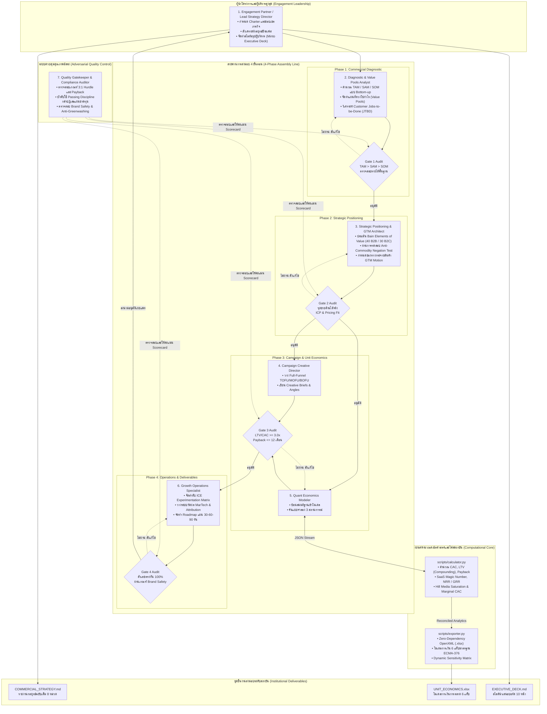

# คู่มือการใช้งานเชิงลึกและคำสั่งสถาปัตยกรรมระดับสากล (End-to-End How-to-Use Guide)
# Institutional Multi-Agent Commercial Strategy & Marketing Consulting System (`marketing-consultant`)

คู่มือภาษาไทยฉบับสมบูรณ์สำหรับการสั่งงาน ให้คำปรึกษากลยุทธ์พาณิชย์ และการวิเคราะห์เศรษฐศาสตร์หน่วย (Unit Economics) ระดับสถาบันการเงินและบริษัทที่ปรึกษาการจัดการระดับโลก (McKinsey, BCG, Bain, Accenture Song) พร้อมเจาะลึกการใช้คำสั่งระดับสูง: **/goal**, **/grill-me**, และ **/boost**

---

## สารบัญ (Table of Contents)

1. [ภาพรวมและปรัชญาการทำงานระดับสถาบัน (Consulting Philosophy & Vision)](#1-ภาพรวมและปรัชญาการทำงานระดับสถาบัน)
2. [7 กฎเหล็กเชิงการบริหาร (The 7 Commercial Governance Axioms)](#2-7-กฎเหล็กเชิงการบริหาร)
3. [ทีมงานที่ปรึกษา AI 7 บทบาทเฉพาะทาง (The 7 Specialized Agent Personas)](#3-ทีมงานที่ปรึกษา-ai-7-บทบาทเฉพาะทาง)
4. [สายพานการส่งมอบ 4 ขั้นตอนพร้อมเกณฑ์ Stage-Gate (4-Phase Stage-Gated Assembly Line)](#4-สายพานการส่งมอบ-4-ขั้นตอนพร้อมเกณฑ์-stage-gate)
5. [เจาะลึกคำสั่ง `/goal`, `/grill-me` และ `/boost` (Deep Dive: Slash Commands)](#5-เจาะลึกคำสั่ง-goal-grill-me-และ-boost)
   - 5.1 ความหมายและการทำงานของ `/goal` (Strategic Mandate)
   - 5.2 ความหมายและการทำงานของ `/grill-me` (Adversarial Red-Team Audit)
   - 5.3 ความหมายและการทำงานของ `/boost` (Autonomous Full Delivery)
   - 5.4 การรวมพลัง 3 คำสั่งในครั้งเดียว (The Institutional Power Combo)
   - 5.5 ชุดคำสั่งสำเร็จรูป (Prompt Templates) สำหรับ 5 สถานการณ์จริง
6. [คู่มือการอ่านและตีความ Deliverables ทั้ง 3 ชิ้น](#6-คู่มือการอ่านและตีความ-deliverables-ทั้ง-3-ชิ้น)
   - 6.1 `COMMERCIAL_STRATEGY.md` (Master Strategy Memo 8 หมวด)
   - 6.2 `UNIT_ECONOMICS.xlsx` (สมุดงานการเงิน 6 แท็บ OpenXML)
   - 6.3 `EXECUTIVE_DECK.md` (สไลด์นำเสนอบอร์ด 10 หน้าตามหลัก Minto Pyramid)
7. [กรณีศึกษาจริง (Real-World Business Case Studies)](#7-กรณีศึกษาจริง)
   - กรณีศึกษา A: B2B Enterprise SaaS (`NexusFlow AI`)
   - กรณีศึกษา B: B2C Premium Functional D2C (`Verve Longevity`)
8. [คู่มือการรันโค้ดเครื่องมือเชิงปริมาณ (CLI Reference)](#8-คู่มือการรันโค้ดเครื่องมือเชิงปริมาณ)
9. [การประเมินผลของ Quality Gatekeeper และการจัดการความเสี่ยง (Governance & Risk)](#9-การประเมินผลของ-quality-gatekeeper)
10. [การแก้ไขปัญหาและคำถามที่พบบ่อย (FAQ & Troubleshooting)](#10-การแก้ไขปัญหาและคำถามที่พบบ่อย)

---

## 1. ภาพรวมและปรัชญาการทำงานระดับสถาบัน

ระบบ **`marketing-consultant`** ได้รับการออกแบบขึ้นเพื่อยกระดับ Antigravity ให้กลายเป็นสำนักที่ปรึกษากลยุทธ์การเติบโตเชิงพาณิชย์และการตลาดระดับเดียวกับสำนักที่ปรึกษาชั้นนำของโลก (McKinsey Growth, Marketing & Sales, BCG Marketing & Sales, Bain Customer Strategy & Marketing, และ Accenture Song)

### ความแตกต่างจากการตลาดแบบเดิม:
- **ปฏิเสธคำโฆษณาเพ้อฝัน (Anti-Fluff)**: ไม่ใช้คำโปรยเลื่อนลอยที่ตรวจสอบไม่ได้ เช่น "เรามุ่งเน้นคุณภาพ", "เป็นมิตรกับลูกค้า", "นวัตกรรมล้ำสมัย"
- **ไม่ใช้ตัวเลขเดาสุ่มจาก AI (Zero LLM Math Hallucination)**: การคำนวณทั้งหมดถูกแยกออกจากโมเดลภาษา และประมวลผลผ่านโค้ดคณิตศาสตร์เชิงปริมาณล้วนใน `scripts/calculator.py`
- **ใช้ข้อมูลจริงและโครงสร้างอุตสาหกรรม (Value Pools & Microeconomics)**: กลยุทธ์ที่ยั่งยืนไม่ได้เกิดจากการยิงแอดหว่าน แต่เกิดจากการหาว่ากำไรของอุตสาหกรรม (Profit Pools) ไปกระจุกตัวอยู่ที่จุดใดของห่วงโซ่คุณค่า แล้วสร้างคูเมืองทางธุรกิจ (Economic Moats) สกัดกั้นคู่แข่ง
- **ส่งมอบไฟล์ระดับสถาบันการเงิน**: ส่งออกไฟล์เอกสารสรุปกลยุทธ์, ไฟล์สไลด์ผู้บริหาร, และสมุดงาน Excel 6 แท็บ (`UNIT_ECONOMICS.xlsx`) ที่เปิดใช้งานได้ทันที

---

## 2. 7 กฎเหล็กเชิงการบริหาร (The 7 Commercial Governance Axioms)

```text
┌────────────────────────────────────────────────────────────────────────────────────────┐
│                        THE 7 COMMERCIAL GOVERNANCE AXIOMS                              │
├──────────────────────────┬──────────────────────────┬──────────────────────────────────┤
│ 1. Value Pools First     │ 2. Anti-Commodity / Fluff│ 3. Retrieval vs Judgment Split   │
│    โฟกัสจุดกำไรสะสม      │    ผ่าน Negation Test    │    แยกดึงข้อมูลออกจากการตีความ │
├──────────────────────────┼──────────────────────────┼──────────────────────────────────┤
│ 4. Deterministic Math    │ 5. 3:1 Hurdle & Payback  │ 6. Strict Passing Discipline     │
│    คณิตศาสตร์ใน Python   │    LTV/CAC >= 3.0x       │    กล้าปฏิเสธแผนที่ทำลายมูลค่า   │
├──────────────────────────┴──────────────────────────┴──────────────────────────────────┤
│ 7. Publication-Grade Institutional Deliverables (OpenXML Spreadsheet & Minto Deck)      │
└────────────────────────────────────────────────────────────────────────────────────────┘
```

1. **Axiom 1: Value Pools First (การหากลุ่มกำไรของอุตสาหกรรม)**: การเติบโตเชิงพาณิชย์ต้องเริ่มจากการวิเคราะห์โครงสร้างตลาด ประเมินขนาดตลาดแบบ Bottom-up ($N_{\text{buyers}} \times \text{ACV}$) และวิเคราะห์ต้นทุนการเปลี่ยนผ่าน (Switching Costs)
2. **Axiom 2: The Anti-Commodity Standard (แบบทดสอบการปฏิเสธ หรือ Negation Test)**: คำประกาศจุดยืนทางการตลาดต้องสามารถพิสูจน์ค้านได้ (Falsifiable) หากคู่แข่งกลับคำเป็นตรงกันข้ามแล้วไม่มีใครยอมรับ (เช่น "เราให้บริการคุณภาพต่ำ") แสดงว่าจุดยืนนั้นเป็นเพียงน้ำท่วมทุ่งและไร้ความหมาย จุดยืนที่แท้จริงต้องสะท้อนถึงสิ่งที่เรา **จงใจเลือกที่จะไม่ทำ**
3. **Axiom 3: Strict Separation of Diagnostic Retrieval and Analytical Judgment**: แยกขั้นตอนการสืบค้นข้อมูลเชิงประจักษ์ (ตัวเลขตลาด, ราคาคู่แข่ง, อัตรา Churn) ออกจากการตัดสินใจเชิงกลยุทธ์ ห้าม AI มโนตัวเลขขึ้นเองเด็ดขาด
4. **Axiom 4: Deterministic Unit Economics in Code**: การคำนวณ CAC, LTV, Payback Period, Net Revenue Retention (NRR), SaaS Magic Number, และ Hill Media Saturation Curves ต้องรันใน Python เท่านั้น
5. **Axiom 5: The 3:1 Asymmetric Commercial Hurdle**: แผนการเติบโตเชิงพาณิชย์จะถือว่าผ่านเกณฑ์และน่าลงทุน ก็ต่อเมื่อมูลค่าตลอดชีพของลูกค้า (LTV) สูงกว่าต้นทุนการได้มาซึ่งลูกค้า (Blended CAC) ไม่ต่ำกว่า **3.0 เท่า** พร้อมทั้งมีระยะเวลาคืนทุน (Payback Period) ไม่เกิน 12 เดือนสำหรับ B2B หรือไม่เกิน 6 เดือนสำหรับ B2C
6. **Axiom 6: Strict Passing Discipline (ความซื่อสัตย์ในการปฏิเสธ)**: หากตรวจสอบแล้วพบว่าเศรษฐศาสตร์หน่วยล้มเหลว ($LTV/CAC < 1.5\text{x}$ หรือ Churn สูงเกินเยียวยา) ระบบจะสั่ง **REJECTED** ทันที และสั่งห้ามทุ่มเงินยิงแอดเด็ดขาด โดยให้เปลี่ยนไปผ่าตัดปรับปรุงสินค้าและโมเดลราคาแทน
7. **Axiom 7: Institutional Spreadsheet Compilation**: ส่งมอบไฟล์ Excel แท้ตามมาตรฐาน ECMA-376 OpenXML มีการจัดฟอร์แมตตัวเลข สีกรมท่าสถาบัน ไฮไลต์เขียว/เหลือง/แดง และตาราง Sensitivity แบบไดนามิก

---

## 3. ทีมงานที่ปรึกษา AI 7 บทบาทเฉพาะทาง



---

## 4. สายพานการส่งมอบ 4 ขั้นตอนพร้อมเกณฑ์ Stage-Gate

ทุกภารกิจจะดำเนินไปตามลำดับเส้นตรง 4 ระยะ โดยไม่สามารถก้าวข้ามระยะได้หากไม่ผ่านการอนุมัติจาก Quality Gatekeeper:

### ระยะที่ 1: การวินิจฉัยเชิงพาณิชย์และ Due Diligence (Phase 1: Diagnostic)
- **เกณฑ์ Gate 1**:
  - [x] ตรรกะ $TAM > SAM > SOM$ ถูกต้องตามหลักคณิตศาสตร์
  - [x] การคำนวณ Bottom-up ยืนยันสอดคล้องกับ SOM ($N \times \text{ACV} \approx \text{SOM}$)
  - [x] วิเคราะห์ JTBD ครบทั้ง 3 งานเชิงฟังก์ชัน และ 2 มิติทางอารมณ์/สังคม
  - [x] บันทึกตัวเลขฐาน (ARPU, Gross Margin, Churn, S&M Spend) ครบถ้วน

### ระยะที่ 2: การวางจุดยืนเชิงกลยุทธ์และ GTM (Phase 2: Positioning)
- **เกณฑ์ Gate 2**:
  - [x] จุดขายผ่านบททดสอบ Negation Test ไม่เป็นคำโฆษณาทั่วไป
  - [x] ระบุคุณค่าตาม Bain Elements of Value ที่อยู่ในระดับท็อป 3-5 รายการ
  - [x] กำหนด Ideal Customer Profile (ICP) และคณะกรรมการจัดซื้อชัดเจน
  - [x] กลไก GTM สอดคล้องกับขนาดสัญญา (เช่น สัญญา $> \$20\text{k}$ ใช้ Sales-Led Growth)

### ระยะที่ 3: สถาปัตยกรรมแคมเปญและคณิตศาสตร์เชิงปริมาณ (Phase 3: Math & Funnel)
- **เกณฑ์ Gate 3**:
  - [x] ผ่านเกณฑ์ $LTV / CAC \ge 3.0\text{x}$ (หากไม่ผ่านต้องระบุจุดบกพร่องเชิงโครงสร้าง)
  - [x] ระยะเวลาคืนทุน $\le 12$ เดือนสำหรับ B2B หรือ $\le 6$ เดือนสำหรับ B2C
  - [x] มีการจำลองเส้นโค้งอิ่มตัวของสื่อ (Hill Media Saturation Curves) ทุกช่องทาง
  - [x] จำลองสถานการณ์ 3 รูปแบบ (Base, Bull, Bear) ครบถ้วน

### ระยะที่ 4: แผนปฏิบัติการและการประมวลผลไฟล์ส่งมอบ (Phase 4: Operations)
- **เกณฑ์ Gate 4**:
  - [x] ตัวเลข 100% สอดคล้องกันทุกจุดระหว่าง Strategy Memo, Excel และ Slide Deck
  - [x] สไลด์ผู้บริหารเรียบเรียงตามหลัก Minto Pyramid ทุกหน้า
  - [x] สร้างไฟล์ `UNIT_ECONOMICS.xlsx` สำเร็จครบทั้ง 6 แท็บ

---

## 5. เจาะลึกคำสั่ง `/goal`, `/grill-me` และ `/boost`

หัวใจสำคัญในการสั่งงานที่ปรึกษาเชิงกลยุทธ์ขั้นสูงคือการใช้ 3 คำสั่งทางการค้า:

```text
/goal <กำหนดเป้าหมายและข้อจำกัด> ──► /grill-me <ทดสอบจุดบกพร่องเชิงรุก> ──► /boost <ส่งมอบผลงานฉบับสมบูรณ์>
```

---

### 5.1 ความหมายและการทำงานของ `/goal`

`/goal` ใช้สำหรับ **กำหนดกรอบภารกิจ วัตถุประสงค์เชิงพาณิชย์ และข้อจำกัดทางการเงิน (Commercial Charter & Scope)**

เมื่อพิมพ์ `/goal` ระบบจะ:
1. เรียก **Engagement Partner** และ **Diagnostic Analyst** เข้ามารับโจทย์
2. ระบุ Archetype ของธุรกิจ (B2B SaaS, B2C D2C, Marketplace หรือ Hybrid)
3. ล็อกเป้าหมายทางการเงิน เช่น อัตรา $LTV/CAC \ge 3.0\text{x}$, คืนทุนภายใน 12 เดือน, หรือการขยาย NRR ให้เกิน 110%
4. กำหนดขอบเขตอุตสาหกรรมและกลุ่มลูกค้าเป้าหมาย (ICP)

**ไวยากรณ์ (Syntax):**
```text
/goal [ชื่อบริษัท / อุตสาหกรรม] [โมเดลธุรกิจ: B2B SaaS | B2C D2C] [ตัวเลขเป้าหมาย: ACV, ARPU, Gross Margin] [วัตถุประสงค์: ขยายตลาด | ปรับโครงสร้าง | เพิ่มประสิทธิภาพช่องทาง] [เกณฑ์ตัวชี้วัด: LTV/CAC >= 3.0x, Payback <= 12m]
```

---

### 5.2 ความหมายและการทำงานของ `/grill-me`

`/grill-me` คือ **โหมดท้าทาย ซักไซ้ เจาะลึก และทดสอบจุดบกพร่องแบบ Devil's Advocate / Red Team**

ผู้บริหารระดับสูงมักตกอยู่ในกับดักคำเยินยอของเอเจนซี่ทั่วไปที่คอยบอกแต่ข่าวดี คำสั่ง `/grill-me` จะเปลี่ยนบทบาทของ AI ให้กลายเป็น **ผู้ตรวจสอบอิสระที่จ้องจับผิดกลยุทธ์ของคุณ** เพื่อไม่ให้บริษัทต้องนำเงินทุนหลักล้านไปละลายแม่น้ำ:

**4 แกนหลักที่ `/grill-me` จะเข้าจู่โจม:**
1. **ทดสอบคำโม้ด้วย Negation Test**: จุดขายของคุณเป็นของจริงหรือแค่คำสวยหรู? ถ้าคู่แข่งพูดตรงกันข้ามแล้วฟังดูไร้สาระ ระบบจะปัดตกทันที
2. **จำลองสภาวะวิกฤต (Downside Stress Shocks)**: หากเดือนหน้า Churn เพิ่มขึ้น 50% หรือค่าแอด Facebook เพิ่มขึ้นเท่าตัว โมเดลธุรกิจของคุณจะขาดสภาพคล่องหรือไม่?
3. **ตรวจสอบกับดักการอิ่มตัวของค่าโฆษณา (Hill Saturation Traps)**: ช่องทางที่คุณกำลังอัดฉีดเงินอยู่ แตะจุดอิ่มตัว $S_{50}$ หรือยัง? มีช่องทางไหนที่ Marginal CAC พุ่งสูงจนไม่คุ้มค่าเงินอีกต่อไป?
4. **การบังคับใช้วินัยในการปฏิเสธ (Passing Discipline)**: หากตัวเลขไม่ผ่านเกณฑ์ 3:1 LTV/CAC ระบบจะออกใบประเมิน **`REJECTED`** ทันที และสั่งห้ามทุ่มงบการตลาดจนกว่าจะแก้ปัญหาที่ตัวผลิตภัณฑ์

**ไวยากรณ์ (Syntax):**
```text
/grill-me [ตัวเลขปัจจุบัน: CAC, Churn, ARPU, งบยิงแอด] [สมมติฐานจุดยืนทางการตลาด / ช่องทางการจัดจำหน่าย]
```

---

### 5.3 ความหมายและการทำงานของ `/boost`

`/boost` คือ **โหมดลงมือทำและส่งมอบผลงานฉบับสมบูรณ์อัตโนมัติ (Autonomous Full-Spectrum Execution)**

เมื่อพิมพ์ `/boost` ระบบจะขับเคลื่อนทีมงานทั้ง 7 บทบาทผ่านสายพาน 4 ขั้นตอน:
1. เรียกใช้โค้ด `scripts/calculator.py` เพื่อคำนวณตัวเลขทางการเงินจริงแบบปราศจากมโน
2. ร่างเอกสารกลยุทธ์ฉบับมาสเตอร์ 8 หมวด ลงสู่ `COMMERCIAL_STRATEGY.md`
3. เรียกใช้โค้ด `scripts/exporter.py` เพื่อคอมไพล์สมุดงานการเงิน 6 แท็บแท้ ลงสู่ `UNIT_ECONOMICS.xlsx`
4. เรียบเรียงสไลด์นำเสนอบอร์ด 10 หน้าตามหลักพีระมิดของ Barbara Minto ลงสู่ `EXECUTIVE_DECK.md`
5. ตรวจสอบความถูกต้องของตัวเลข 100% ข้ามเอกสารทั้ง 3 ฉบับ

**ไวยากรณ์ (Syntax):**
```text
/boost [ไฟล์ Input JSON หรือชื่อโปรไฟล์] [โฟลเดอร์สำหรับส่งมอบผลงาน]
```

---

### 5.4 การรวมพลัง 3 คำสั่งในครั้งเดียว (The Institutional Power Combo)

เมื่อคุณนำทั้ง 3 คำสั่งมาร้อยเรียงเข้าด้วยกัน คุณจะได้การทำงานระดับสถาบันที่สมบูรณ์แบบในข้อความเดียว:

```text
/goal วางกลยุทธ์พาณิชย์สำหรับ NexusFlow AI (B2B SaaS, สัญญารายปี $30,000, Gross Margin 82%), กำหนดเกณฑ์ LTV/CAC >= 3.0x และ Payback <= 12 เดือน
/grill-me ตรวจสอบสมมติฐาน Churn 1.2%/เดือนว่าต่ำเกินจริงหรือไม่ พร้อมตรวจสอบว่าแอด LinkedIn เดือนละ $85,000 ชนเพดานอิ่มตัว (Hill Saturation) หรือยัง
/boost ดำเนินการผ่านสายพาน 4 ขั้นตอน รัน calculator.py และ exporter.py พร้อมส่งออก COMMERCIAL_STRATEGY.md, UNIT_ECONOMICS.xlsx และ EXECUTIVE_DECK.md
```

---

### 5.5 ชุดคำสั่งสำเร็จรูป (Prompt Templates) สำหรับ 5 สถานการณ์จริง

#### สถานการณ์ที่ 1: การเปิดตัวผลิตภัณฑ์ระดับองค์กร (B2B Enterprise SaaS GTM Launch)
```text
/goal ออกแบบกลยุทธ์ Go-To-Market สำหรับซอฟต์แวร์บริหารคลังสินค้าอัจฉริยะ กลุ่มเป้าหมายคือธุรกิจขนาดกลาง-ใหญ่ ACV $45,000 อัตรากำไรขั้นต้น 78% ทีมขาย 5 คน งบการตลาด $180,000/เดือน ต้องการลูกค้ารายใหม่ 12 ราย/เดือน
/grill-me ทดสอบจุดอ่อนของโมเดล Enterprise Sales-Led Growth ว่า Sales Cycle 90 วันจะทำให้กระแสเงินสดตึงตัวหรือไม่ และตรวจสอบจุดยืนของเราเทียบกับ SAP/Oracle ผ่าน Negation Test
/boost รันการคำนวณทั้งหมดและสร้างไฟล์ Strategy Memo, โมเดล Excel 6 แท็บ และสไลด์ผู้บริหาร
```

#### สถานการณ์ที่ 2: การฟื้นฟูธุรกิจ D2C ที่ประสบปัญหา Churn (D2C Subscription Turnaround)
```text
/goal ฟื้นฟูกลยุทธ์ของแบรนด์อาหารเสริมเพื่อสุขภาพระบบสมาชิกรายเดือน AOV $65, Churn ปัจจุบันสูงถึง 9.5%/เดือน และ Blended CAC พุ่งขึ้นเป็น $75 กำไรขั้นต้น 68% เป้าหมายคือลด Payback ให้ต่ำกว่า 4 เดือน และฟื้นฟู LTV/CAC ให้เกิน 3.5x
/grill-me สแกนหารอยรั่วใน Funnel วิเคราะห์ว่าทำไมลูกค้าเดือนที่ 2 ถึงหายไปกว่า 50% และจำลองกรณีเลวร้ายที่สุด (Bear Case) หากค่าแอด Meta เพิ่มขึ้นอีก 30%
/boost ออกแบบแคมเปญ TOFU/MOFU/BOFU ใหม่ พร้อมโมเดล Cohort 24 เดือนใน UNIT_ECONOMICS.xlsx และแผนทดลอง ICE ในแท็บที่ 6
```

#### สถานการณ์ที่ 3: การจัดสรรงบประมาณสื่อข้ามช่องทาง (Media Budget Allocation via Hill Saturation)
```text
/goal ปรับพอร์ตงบการตลาด $300,000/เดือน ข้ามช่องทาง Google Search ($120k), LinkedIn ($100k) และ Outbound SDR ($80k) สำหรับธุรกิจ B2B FinTech
/grill-me คำนวณอนุพันธ์ของ Hill Saturation Function ของแต่ละช่องทาง ชี้ชัดว่าช่องทางใดกำลังเผาเงินเกินจุด S_50 และช่องทางใดมี Marginal CAC ถูกที่สุดที่ควรเทเงินเพิ่ม
/boost สรุปตารางจัดสรรงบประมาณใหม่ และบันทึกลงใน Tab 4 ของ UNIT_ECONOMICS.xlsx
```

#### สถานการณ์ที่ 4: การตรวจสอบวิเคราะห์สถานะเชิงพาณิชย์สำหรับ VC / Private Equity (Commercial Due Diligence)
```text
/goal ทำ Commercial Due Diligence ตรวจสอบบริษัทเป้าหมาย Series B ที่อ้างว่ามี ARR $12M, อัตรา NRR 118% และ S&M Magic Number 1.8x
/grill-me ชำแหละตัวเลข NRR 118% ว่ามาจากการขึ้นราคากับลูกค้าเดิมเพื่อกลบเกลื่อนปัญหา Logo Churn หรือไม่ และทดสอบความยืดหยุ่นของ Gross Margin เมื่อต้องขยายทีม Customer Success
/boost สรุปรายงาน Investment Committee Memo และ Quality Scorecard บันทึกสถานะ Pass/Fail ของแต่ละ Gate
```

#### สถานการณ์ที่ 5: การสร้างระบบทดลองการเติบโตแบบ High-Tempo (ICE Experimentation Engine)
```text
/goal วางระบบทดลองการเติบโต (Growth Experimentation) สำหรับ Marketplace เพื่อเร่ง GMV จาก $10M เป็น $30M ใน 12 เดือน
/grill-me คัดกรองไอเดียทดลอง 10 รายการแรก ตัดไอเดียที่ได้แค่ผลทางสายตา (Vanity Experiments) ทิ้ง และให้คะแนน Impact x Confidence x Ease อย่างเข้มงวด
/boost บันทึก Backlog การทดลองลงใน Tab 6 ของ UNIT_ECONOMICS.xlsx พร้อมทำแผนปฏิบัติการ 30-60-90 วัน
```

---

## 6. คู่มือการอ่านและตีความ Deliverables ทั้ง 3 ชิ้น

เมื่อรันเสร็จสมบูรณ์ ระบบจะส่งมอบไฟล์เอกสาร 3 ชิ้นลงในโฟลเดอร์ทำงาน:

```text
                                  DELIVERABLES SUITE
                                           │
         ┌─────────────────────────────────┼─────────────────────────────────┐
         ▼                                 ▼                                 ▼
1. COMMERCIAL_STRATEGY.md         2. UNIT_ECONOMICS.xlsx            3. EXECUTIVE_DECK.md
   - เอกสารกลยุทธ์ฉบับมาสเตอร์       - สมุดงานการเงิน 6 แท็บ           - สไลด์นำเสนอบอร์ด 10 หน้า
   - เนื้อหาลึก 8 หมวดหมู่          - รันใน OpenXML มาตรฐาน           - โครงสร้างตาม Minto Pyramid
   - แผนปฏิบัติการ 30-60-90 วัน     - ตาราง Sensitivity แบบไดนามิก   - Action Titles ทุกแผ่น
```

---

### 6.1 `COMMERCIAL_STRATEGY.md` (Master Strategy Memo)

เอกสารสรุปกลยุทธ์ฉบับสมบูรณ์ความยาว 8 หมวดมาตรฐาน:
1. **Executive Summary & Commercial Charter**: บทสรุปผู้บริหาร สรุปวิทยานิพนธ์เชิงกลยุทธ์ และมติการอนุมัติงบประมาณ
2. **Market Diagnostic & Value Pools**: ขนาดตลาด TAM/SAM/SOM แบบ Bottom-up และจุดสะสมกำไรในห่วงโซ่คุณค่า
3. **Customer JTBD & ICP Definition**: ตารางวิเคราะห์งานที่ลูกค้าต้องทำ (JTBD) และโครงสร้างคณะกรรมการจัดซื้อ
4. **Strategic Positioning & Bain Elements of Value**: คะแนนคุณค่าตามกรอบ Bain 40/30 ข้อ และจุดยืนที่ผ่าน Negation Test
5. **Full-Funnel Go-To-Market Architecture**: แผนผัง TOFU (สร้างการรับรู้), MOFU (การพิจารณา), BOFU (การตัดสินใจ)
6. **Quantitative Unit Economics & Capital Efficiency**: สรุปตัวเลข CAC, LTV, Payback, Magic Number, และ NRR
7. **Creative Strategy & Angle Specifications**: ตัวอย่างบรีฟโฆษณา 3 ชุด พร้อม Hook, Pain, Mechanism, Proof, CTA
8. **30-60-90 Day Operating Roadmap & Risk Governance**: แผนสปรินต์รายเดือนพร้อมผู้รับผิดชอบ (DRI) และมาตรการฉุกเฉิน

---

### 6.2 `UNIT_ECONOMICS.xlsx` (Institutional OpenXML Workbook)

สมุดงาน Microsoft Excel แท้ 6 แท็บ ที่จัดรูปแบบสีกรมท่าสถาบัน พร้อมตัวเลขแบบเนทีฟ:

```text
┌────────────────────────────────────────────────────────────────────────────────────────┐
│                        UNIT_ECONOMICS.xlsx (6-TAB WORKBOOK)                            │
├────────────────────────────────┬───────────────────────────────────────────────────────┤
│ Tab 1: Executive Dashboard     │ สรุป KPI สำคัญ, ใบคะแนน Gate 1-4, มติการอนุมัติ       │
├────────────────────────────────┼───────────────────────────────────────────────────────┤
│ Tab 2: CAC & Payback           │ แยกค่าใช้จ่าย S&M, CAC ผสม vs จ่ายเงิน, ตารางคืนทุน 24 ด. │
├────────────────────────────────┼───────────────────────────────────────────────────────┤
│ Tab 3: Cohort Retention        │ เส้นโค้งการคงอยู่ 24 เดือน, ลูกค้าที่ยัง Active, MRR Decay │
├────────────────────────────────┼───────────────────────────────────────────────────────┤
│ Tab 4: Media Budget & Hill Sat │ พารามิเตอร์ Hill Saturation, ขั้นงบประมาณ, Marginal CAC│
├────────────────────────────────┼───────────────────────────────────────────────────────┤
│ Tab 5: Scenario Sensitivity    │ เปรียบเทียบ Base vs Bull vs Bear, ตาราง 2D Churn/ARPU │
├────────────────────────────────┼───────────────────────────────────────────────────────┤
│ Tab 6: ICE Growth Matrix       │ รายการทดลองการเติบโต จัดลำดับตามคะแนน I x C x E        │
└────────────────────────────────┴───────────────────────────────────────────────────────┘
```

#### วิธีอ่านข้อมูลสำคัญในแต่ละแท็บ:
- **Tab 1 (Dashboard)**: ดูตาราง **Quality Scorecard** หากช่องใดขึ้นสถานะ `FAIL` ตัวหนังสือสีแดง แสดงว่าแผนมีข้อบกพร่อง ห้ามขยายงบประมาณ
- **Tab 2 (Payback Trajectory)**: ดูคอลัมน์ **Cumulative Gross Profit** เทียบกับ **Blended CAC** จุดที่ตัวเลขเปลี่ยนจากติดลบเป็นบวก คือเดือนที่ธุรกิจคืนทุนจากลูกค้ารายนั้น
- **Tab 3 (Cohort Decay)**: สังเกตแนวโน้มของ Cohort MRR ในธุรกิจ B2B ที่ดี แม้จำนวนลูกค้า (Logos) จะลดลง แต่อัตรา MRR รวมควรขยายตัวขึ้นเรื่อยๆ จากพลังของ Net Expansion ($NRR > 100\%$)
- **Tab 4 (Hill Saturation)**: ตรวจดูคอลัมน์ **Marginal CAC** หากช่องทางใดมี Marginal CAC สูงเกิน 1.5 เท่าของเป้าหมาย หรือ Saturation % สูงกว่า 80% ให้ระงับการเพิ่มงบในช่องทางนั้น แล้วโยกเงินไปช่องทางที่อยู่ต้นโค้ง S-curve แทน
- **Tab 5 (Sensitivity Matrix)**: สแกนดูตารางสองมิติระหว่าง Churn และ ARPU เพื่อหาจุดคุ้มทุนต่ำสุด (Downside Floor) ในกรณีที่เกิดสภาวะเศรษฐกิจถดถอย
- **Tab 6 (ICE Backlog)**: ทดลองทำรายการที่มีคะแนน $\ge 500$ (Quick Wins ไฮไลต์สีเขียวอ่อน) ในสปรินต์เดือนแรกทันที

---

### 6.3 `EXECUTIVE_DECK.md` (Board Presentation Deck)

สไลด์นำเสนอ 10 หน้าที่สร้างขึ้นตามหลักพีระมิดของ Barbara Minto:
- **Slide 1**: Executive Commercial Thesis & Strategic Mandate (วิทยานิพนธ์และเป้าหมายเชิงกลยุทธ์)
- **Slide 2**: Market Size & Value Pool Realities (ความเป็นจริงของขนาดตลาดและกำไร TAM/SAM/SOM)
- **Slide 3**: Customer Friction & Jobs-to-be-Done (แรงต้านของลูกค้าและงานที่ต้องทำให้สำเร็จ)
- **Slide 4**: Differentiated Strategic Positioning & Moat (จุดยืนที่แตกต่างและคูเมืองป้องกันคู่แข่ง)
- **Slide 5**: Full-Funnel GTM & Channel Distribution Architecture (โครงสร้างการกระจายสินค้าครบวงจร)
- **Slide 6**: Unit Economics Engine (เครื่องยนต์เศรษฐศาสตร์หน่วย: CAC, LTV, Payback, Magic Number)
- **Slide 7**: Channel Capital Efficiency & Diminishing Returns (ประสิทธิภาพสื่อและจุดคุ้มทุน Hill Saturation)
- **Slide 8**: 3-Scenario Sensitivity Modeling (แบบจำลองความอ่อนไหว Base, Bull, Bear)
- **Slide 9**: High-Tempo Experimentation Engine (แผนผังการทดลองเพื่อการเติบโต ICE Backlog)
- **Slide 10**: 30-60-90 Day Execution Roadmap & Capital Allocation (แผนปฏิบัติการ 90 วันและการจัดสรรทุน)

---

## 7. กรณีศึกษาจริง

### กรณีศึกษา A: B2B Enterprise SaaS (`NexusFlow AI`)

```text
┌────────────────────────────────────────────────────────────────────────────────────────┐
│                        CASE STUDY A: NEXUSFLOW AI (B2B SAAS)                           │
├────────────────────────────────────────┬───────────────────────────────────────────────┤
│ โมเดลธุรกิจ                            │ ระบบประสานงาน AI และการตัดสินใจระดับองค์กร    │
│ มูลค่าสัญญารายปี (ACV)                 │ $30,000 / ปี ($2,500 / เดือน ARPU)            │
│ อัตรากำไรขั้นต้น (Gross Margin)        │ 82.0%                                         │
│ อัตราการสูญเสียลูกค้ารายเดือน (Churn)  │ 1.2% ต่อเดือน (การคงอยู่ระดับโลโก้ 86.5%/ปี)   │
│ อัตราการขยายตัวรายเดือน (Expansion)   │ 1.8% ต่อเดือน (เกิดสภาวะ Net Negative Churn)  │
│ อัตรา Net Revenue Retention (NRR)      │ 107.5% ต่อปี                                  │
│ งบการตลาดและการขายรายเดือน             │ $240,000 (ค่าแอด $155,000 + ค่าทีม SDR $85k)   │
│ จำนวนลูกค้าใหม่ต่อเดือน                │ 20 องค์กร (ได้จากช่องทางจ่ายเงิน 13, ออร์แกนิก 7)│
├────────────────────────────────────────┴───────────────────────────────────────────────┤
│ ผลลัพธ์จากการคำนวณทางคณิตศาสตร์ (DETERMINISTIC RESULTS):                               │
│   • ต้นทุนการได้มาซึ่งลูกค้าผสม (Blended CAC): $12,000.00                              │
│   • ต้นทุนจากช่องทางจ่ายเงิน (Paid CAC):       $11,923.08                              │
│   • กำไรขั้นต้นต่อลูกค้ารายเดือน:              $2,050.00                               │
│   • มูลค่าตลอดชีพดั้งเดิม (Traditional LTV):   $170,833.33                             │
│   • มูลค่าตลอดชีพรวมการขยาย (Expansion LTV):   $220,805.46                             │
│   • ระยะเวลาคืนทุน (Payback Period):           5.9 เดือน (เกณฑ์: <= 12.0 เดือน) [PASS] │
│   • อัตราส่วน LTV / CAC:                       18.4x (Expansion) / 14.2x (Trad) [PASS] │
│   • SaaS Magic Number:                         4.12 (เกณฑ์: >= 0.75) [TOP DECILE]      │
│   • ผลการตรวจสอบ (Audit Verdict):              APPROVED (เศรษฐศาสตร์หน่วยระดับโลก)     │
└────────────────────────────────────────────────────────────────────────────────────────┘
```

**ข้อค้นพบเชิงกลยุทธ์:**
1. ธุรกิจมีสุขภาพแข็งแกร่งอย่างยิ่ง มี $LTV/CAC = 18.4\text{x}$ และคืนทุนในเวลาเพียง 5.9 เดือน
2. อย่างไรก็ตาม การวิเคราะห์ Hill Saturation Curve พบว่า แอด LinkedIn ($85k/เดือน) กำลังเข้าใกล้จุดอิ่มตัว 83% โดยมี Marginal CAC สูงถึง $1,450 ต่อ Lead
3. คำแนะนำ: ตรึงงบ LinkedIn ไว้ที่ $85k แล้วโยกเงินส่วนเพิ่ม $35k ไปขยายระบบ Outbound SDR Automation ซึ่งยังมีความอิ่มตัวเพียง 61%

---

### กรณีศึกษา B: B2C Premium Functional D2C (`Verve Longevity`)

```text
┌────────────────────────────────────────────────────────────────────────────────────────┐
│                        CASE STUDY B: VERVE LONGEVITY (B2C D2C)                         │
├────────────────────────────────────────┬───────────────────────────────────────────────┤
│ โมเดลธุรกิจ                            │ เครื่องดื่มฟังก์ชันนัลและโภชนาการพรีเมียม D2C │
│ มูลค่าคำสั่งซื้อเฉลี่ย (AOV)           │ $68.00 (ความถี่ในการซื้อเฉลี่ย 3.6 ครั้ง/ปี)  │
│ ยอดขายเฉลี่ยต่อเดือน (Monthly ARPU)    │ $20.40 / เดือน ($244.80 ต่อปีต่อราย)          │
│ อัตรากำไรขั้นต้น (Gross Margin)        │ 68.0%                                         │
│ อัตราการยกเลิกรายเดือน (Monthly Churn) │ 7.5% ต่อเดือน                                 │
│ งบการตลาดรายเดือน                      │ $120,000 (แอดโซเชียล $95,000 + ทีมงาน $25k)   │
│ จำนวนลูกค้าใหม่ต่อเดือน                │ 2,400 ราย (แอด 1,800 ราย, ออร์แกนิก 600 ราย)   │
├────────────────────────────────────────┴───────────────────────────────────────────────┤
│ ผลลัพธ์จากการคำนวณทางคณิตศาสตร์ (DETERMINISTIC RESULTS):                               │
│   • ต้นทุนการได้มาซึ่งลูกค้าผสม (Blended CAC): $50.00                                  │
│   • ต้นทุนจากช่องทางจ่ายเงิน (Paid CAC):       $52.78                                  │
│   • มูลค่าตลอดชีพรวมการขยาย (Expansion LTV):   $198.17                                 │
│   • ระยะเวลาคืนทุน (Payback Period):           3.6 เดือน (เกณฑ์: <= 6.0 เดือน) [PASS]  │
│   • อัตราส่วน LTV / CAC:                       4.0x (เกณฑ์: >= 3.0x) [PASS]            │
│   • ผลการตรวจสอบ (Audit Verdict):              APPROVED                                │
└────────────────────────────────────────────────────────────────────────────────────────┘
```

**ข้อค้นพบเชิงกลยุทธ์:**
1. ในโมเดล D2C การคืนทุนเร็ว (Payback 3.6 เดือน) คือเกราะป้องกันกระแสเงินสดที่ดีที่สุด
2. เส้นโค้ง Cohort ชี้ว่าจุดเสี่ยงสำคัญคือเดือนที่ 1 ไปเดือนที่ 2 ซึ่งมีลูกค้าหายไปเกือบครึ่ง
3. คำแนะนำ: รันการทดลอง `D2C-01` (ให้สิทธิประโยชน์สมัครแบบ Subscribe & Save อัตโนมัติ) ควบคู่กับ `D2C-03` (ส่งข้อความติดตามผลจากนักกำหนดอาหารในวันที่ 14) เพื่อดึงการคงอยู่เดือนที่ 2 จาก 52% เป็น 62%

---

## 8. คู่มือการรันโค้ดเครื่องมือเชิงปริมาณ (CLI Reference)

คุณสามารถสั่งรันโค้ดคำนวณและคอมไพล์ Excel ผ่าน Terminal ได้โดยตรง โดยไม่ต้องพึ่งพาไลบรารีภายนอก:

```bash
# 1. รันการคำนวณ Unit Economics สำหรับโปรไฟล์ B2B SaaS
python3 scripts/calculator.py \
  --input templates/sample_inputs.json \
  --profile b2b_saas \
  --output calculated_results.json \
  --print-summary

# 2. รันการคำนวณสำหรับโปรไฟล์ B2C D2C
python3 scripts/calculator.py \
  --input templates/sample_inputs.json \
  --profile b2c_d2c \
  --output calculated_results.json \
  --print-summary

# 3. คอมไพล์ไฟล์ Excel 6 แท็บจากผลลัพธ์ JSON
python3 scripts/exporter.py \
  --input calculated_results.json \
  --output ./UNIT_ECONOMICS.xlsx

# 4. ทดสอบความถูกต้องของชุดโค้ดคำนวณ (13 การทดสอบครอบคลุมทุกเงื่อนไขขอบเขต)
python3 scripts/calculator.py --test

# 5. ทดสอบความถูกต้องของโครงสร้าง OpenXML ZIP
python3 scripts/exporter.py --test
```

---

## 9. การประเมินผลของ Quality Gatekeeper

เมื่อตรวจสอบเสร็จสิ้น คณะกรรมการตรวจรับงาน (Quality Gatekeeper) จะออกใบคะแนน Audit Scorecard ใน Tab 1 ของ Excel และสรุปใน Memo:

| ผลการตัดสิน | ความหมายทางการเงิน | การปฏิบัติที่ผู้บริหารต้องสั่งการ |
| :--- | :--- | :--- |
| **`APPROVED`** (สีเขียว) | ตัวเลขผ่านเกณฑ์สถาบัน ($LTV/CAC \ge 3.0\text{x}$, Payback อยู่ในกรอบ, $NRR \ge 100\%$) | **อนุมัติงบประมาณเต็มจำนวน**: ให้ทีม Growth Ops ดำเนินการตามแผนทดลอง Sprint 1 ได้ทันที |
| **`CONDITIONAL`** (สีเหลือง) | ตัวเลขอยู่ในเกณฑ์ปานกลาง ($1.5\text{x} \le LTV/CAC < 3.0\text{x}$ หรือ Payback เริ่มยืดเยื้อ) | **ตรึงงบการตลาด (Budget Freeze)**: ห้ามเพิ่มงบยิงแอด ให้มุ่งเน้นการปรับปรุง Onboarding, ลด Churn และปรับแพ็กเกจราคา |
| **`REJECTED`** (สีแดง) | ตัวเลขทำลายมูลค่ากิจการ ($LTV/CAC < 1.5\text{x}$ หรือ Churn สูงจนเป็นถังน้ำรั่ว) | **ผ่าตัดธุรกิจด่วน (Commercial Surgery)**: หยุดแอดทุกช่องทางทันที กลับไปค้นหา Product-Market Fit และรื้อโครงสร้างราคาใหม่ |

---

## 10. การแก้ไขปัญหาและคำถามที่พบบ่อย

### คำถาม 1: หากกรอกเปอร์เซ็นต์เป็นตัวเลขเต็ม เช่น 80 แทน 0.80 โค้ดจะพังหรือไม่?
**ตอบ**: ไม่พัง โค้ด `scripts/calculator.py` ได้รับการออกแบบให้มีระบบ Auto-Normalization หากค่าของ `gross_margin_pct`, `monthly_logo_churn`, หรือ `monthly_expansion_rate` มีค่ามากกว่า 1.0 โค้ดจะหารด้วย 100 ให้อัตโนมัติ

### คำถาม 2: สภาพแวดล้อมที่ไม่มีสิทธิ์ติดตั้ง `openpyxl` หรือ `pandas` จะใช้งานได้หรือไม่?
**ตอบ**: ใช้งานได้ 100% เพราะทั้ง `calculator.py` และ `exporter.py` เขียนด้วย Pure Python มาตรฐาน (ใช้เพียง `zipfile`, `json`, `math`, และ `xml.sax.saxutils`) จึงสามารถรันได้ในทุกเครื่อง ทุกเซิร์ฟเวอร์ และทุกคลัสเตอร์ CI/CD โดยไม่ต้องเชื่อมต่ออินเทอร์เน็ตเพื่อดาวน์โหลด pip package ใดๆ

### คำถาม 3: ทำไมค่า LTV แบบ Expansion ถึงสูงกว่า Traditional เสมอ?
**ตอบ**: ตามหลักเศรษฐศาสตร์ หากลูกค้ามีการซื้อเพิ่ม (Expansion $> 0$) มูลค่าตลอดชีพย่อมไม่มีทางต่ำกว่ากรณีที่ไม่มีการซื้อเพิ่มอย่างเด็ดขาด โค้ดของเรามีกลไกรับประกัน **Economic Invariant Guarantee** ที่ป้องกันไม่ให้เกิดความผิดพลาดทางคณิตศาสตร์ในกรณีที่ Net Churn กลายเป็นลบ

---

*จัดทำโดย คณะทำงานกลยุทธ์เชิงพาณิชย์และการตลาด Google Antigravity Practice*
