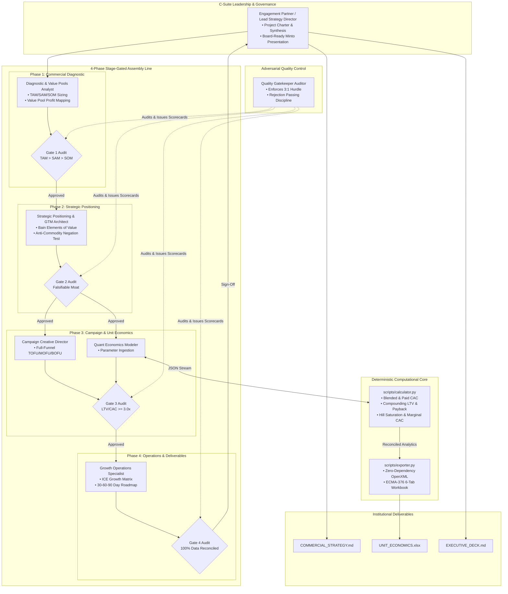

# `marketing-consultant`: Institutional Multi-Agent Commercial Strategy Engine

An institutional-grade commercial strategy and marketing consulting engine modeled after elite global management consulting firms—**McKinsey & Company** (Growth, Marketing & Sales), **Boston Consulting Group** (BCG Marketing & Sales), **Bain & Company** (Customer Strategy & Marketing), and **Accenture Song**.

This skill transforms Google Antigravity into a strategic consulting practice that rejects superficial marketing fluff, eliminates LLM math hallucinations, and enforces financial rigor across customer acquisition, positioning, and unit economics.

---

## 📚 Exhaustive Documentation

Complete documentation is available in the [`docs/`](docs/) directory:

| Guide | Target Audience | Key Contents |
| :--- | :--- | :--- |
| [**คู่มือการใช้งานภาษาไทย (HOW_TO_USE.md)**](HOW_TO_USE.md) | ผู้บริหาร, ผู้ประกอบการ, CMO, CFO, ที่ปรึกษากลยุทธ์ | คู่มือภาษาไทยฉบับสมบูรณ์: เจาะลึกคำสั่ง `/goal`, `/grill-me`, `/boost`, สถาปัตยกรรม MBB 7 เอเจนต์, การอ่านไฟล์ทั้ง 3 ชิ้น และกรณีศึกษาจริง |
| [**Executive & Non-Technical Guide**](docs/NON_TECHNICAL_GUIDE.md) | CEOs, CMOs, CROs, CFOs, PE/VC Partners, Marketing Directors | MBB consulting philosophy, 7 agent personas, 4-phase assembly line, deliverable walkthroughs, B2B SaaS & B2C D2C case studies, and executive slash command playbooks. |
| [**Technical & Quantitative Specification**](docs/TECHNICAL_DOCUMENTATION.md) | Software Engineers, Quant Financial Engineers, Growth Analysts | Formal mathematical derivations (CAC, LTV, Payback, Hill saturation, Magic Number), `calculator.py` API, zero-dependency OpenXML ECMA-376 architecture, JSON schemas, and test suites. |

---

## 🏛️ Multi-Agent Architecture & Pipeline



---

## 🚀 Quickstart: The `/goal`, `/grill-me` & `/boost` Workflow

The engine supports three standardized commercial slash commands for both AI-native execution and human-in-the-loop governance:

```text
/goal <Mandate & Targets> ──► /grill-me <Adversarial Stress Test> ──► /boost <Autonomous Full Delivery>
```

1. **/goal**: Sets the commercial scope, business model profile, and target financial hurdles:
   ```text
   /goal Develop commercial strategy for NexusFlow AI (B2B SaaS, $30k ACV, 82% GM), enforcing 3:1 LTV/CAC hurdle and 12-month payback ceiling.
   ```
2. **/grill-me**: Activates the adversarial **Devil's Advocate / Red Team Mode**. The Quality Gatekeeper attacks vanity metrics, runs the Anti-Commodity Negation Test, tests +50% churn stress scenarios, and audits media channels for Hill saturation traps before releasing budget:
   ```text
   /grill-me Audit our B2B SaaS metrics: 1.2% monthly churn, $12k CAC, and $85k/mo on LinkedIn ABM. Flag leaky buckets and identify where marginal CAC explodes.
   ```
3. **/boost**: Triggers **Autonomous Full-Spectrum Execution**. Runs deterministic calculations in Python, generates `COMMERCIAL_STRATEGY.md`, compiles the 6-tab `UNIT_ECONOMICS.xlsx`, and outputs the 10-slide `EXECUTIVE_DECK.md`:
   ```text
   /boost Run complete 4-phase commercial consulting assembly line on templates/sample_inputs.json (profile: b2b_saas) and export all 3 deliverables.
   ```

---

## ⚡ Command Line Quick Start

### 1. Run Quantitative Unit Economics Analysis
Analyze a client's commercial inputs deterministically in Python:
```bash
# Analyze B2B SaaS profile
python3 scripts/calculator.py \
  --input templates/sample_inputs.json \
  --profile b2b_saas \
  --output calculated_results.json \
  --print-summary

# Analyze B2C D2C profile
python3 scripts/calculator.py \
  --input templates/sample_inputs.json \
  --profile b2c_d2c \
  --output calculated_results.json \
  --print-summary
```

### 2. Compile Institutional 6-Tab Excel Workbook
Compile the publication-grade `UNIT_ECONOMICS.xlsx` workbook directly (zero external dependencies):
```bash
# Build spreadsheet from calculated results
python3 scripts/exporter.py \
  --input calculated_results.json \
  --output ./UNIT_ECONOMICS.xlsx
```

### 3. Run Built-In Self-Tests
Verify mathematics, edge-case resilience, and OpenXML integrity:
```bash
# Run calculator test suite (13 assertions)
python3 scripts/calculator.py --test

# Run OpenXML exporter test suite
python3 scripts/exporter.py --test
```

---

## 📂 Repository Manifest

```text
/Users/tonkla/.gemini/config/skills/marketing-consultant/
├── SKILL.md                          # Master skill definition & prompt instructions
├── README.md                         # Repository overview & quick start
├── HOW_TO_USE.md                     # Comprehensive Thai user manual & slash command guide
├── docs/
│   ├── NON_TECHNICAL_GUIDE.md        # Comprehensive executive & business strategy guide
│   └── TECHNICAL_DOCUMENTATION.md    # Quantitative mathematics & developer specifications
├── scripts/
│   ├── calculator.py                 # Deterministic quantitative unit economics engine (13 tests)
│   └── exporter.py                   # Zero-dependency ECMA-376 OpenXML spreadsheet compiler
└── templates/
    └── sample_inputs.json            # Reference benchmarks for B2B SaaS and B2C D2C
```

---

## 🏛️ Multi-Agent Syndicate & 4-Phase Assembly Line

The system operates as a linear **4-Phase Stage-Gated Assembly Line** staffed by **7 specialized commercial agents**:

```text
Phase 1: Diagnostic ──► [Gate 1] ──► Phase 2: Positioning ──► [Gate 2] ──► Phase 3: Funnel & Math ──► [Gate 3] ──► Phase 4: Execution ──► [Gate 4 Audit]
```

### The 7 Agent Personas:
1. **Engagement Partner / Lead Strategy Director**: Engagement governance, strategic synthesis, executive memos, and board deck narrative.
2. **Commercial Diagnostic & Value Pools Analyst**: TAM/SAM/SOM sizing (top-down and bottom-up), value pool mapping, and customer Jobs-to-be-Done (JTBD).
3. **Strategic Positioning & GTM Architect**: Bain Elements of Value scoring, anti-commodity differentiation, and GTM distribution motions.
4. **Campaign Creative Director & Funnel Architect**: Full-funnel TOFU/MOFU/BOFU journeys, creative briefs (Hook, Pain, Mechanism, Proof, CTA), and landing page wireframes.
5. **Quantitative Economics Modeler**: Deterministic unit economics, Hill media saturation curves, 24-month cohort decay, and 3-scenario sensitivity.
6. **Growth Operations & MarTech Experimentation Specialist**: High-tempo ICE experimentation backlog, attribution taxonomy, and 30-60-90 day roadmaps.
7. **Quality Gatekeeper & Compliance Auditor**: Adversarial stage-gate auditing, Gate 1-4 audit scorecards, and cross-deliverable numerical reconciliation.

---

## 📦 The 3 Publication-Grade Deliverables

Every engagement generates three boardroom-ready deliverables:

1. **`COMMERCIAL_STRATEGY.md`**: An exhaustive 8-section master commercial strategy memo covering executive charters, market sizing, JTBD, Bain positioning, full-funnel GTM, quantitative economics, creative briefs, and 30-60-90 day sprint roadmaps.
2. **`UNIT_ECONOMICS.xlsx`**: An institutional 6-tab financial model compiled via OpenXML:
   - **Tab 1: Executive Dashboard & Quality Scorecard** (KPI summary and Gate 1-4 audit scorecards).
   - **Tab 2: CAC, LTV & Payback Trajectory** (Month-by-month cash recovery and breakeven).
   - **Tab 3: Cohort Retention & Churn Decay** (24-month retention curve and active customer decay).
   - **Tab 4: Media Budget Allocation & Saturation Curve** (Hill function parameters, spend tiers, and marginal CAC).
   - **Tab 5: 3-Scenario Sensitivity Analysis** (Base vs Bull vs Bear, and 2D Churn vs ARPU sensitivity grid).
   - **Tab 6: High-Tempo Experimentation (ICE Growth Matrix)** (Growth backlog prioritized by Impact, Confidence, and Ease).
3. **`EXECUTIVE_DECK.md`**: A 10-slide board presentation structured according to Barbara Minto's Pyramid Principle, featuring declarative action titles, quantified proof points, and strategic takeaways.

---

## ⚖️ Governance & Passing Discipline

The consulting engine enforces a strict **"Passing Discipline"**:
- **The 3:1 Asymmetric Hurdle**: $\text{LTV} / \text{Blended CAC} \ge 3.0\text{x}$.
- **Capital Payback Ceiling**: $\le 12.0\text{ months}$ (B2B SaaS) or $\le 6.0\text{ months}$ (B2C D2C).
- If unit economics fail these hurdles, the Quality Gatekeeper issues a **`REJECTED`** verdict at Gate 3. Top-of-funnel ad spend is frozen, and focus shifts to repairing retention, pricing architecture, and customer onboarding.

---

*Part of the Google Antigravity Agentic Practice.*
