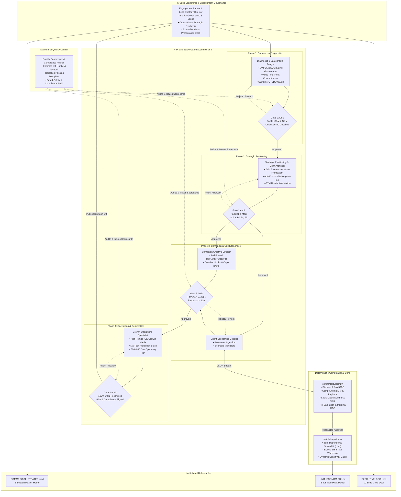

# Institutional Commercial Strategy & Marketing Consulting Engine
## Executive & Non-Technical Strategic Guide

---

## Executive Summary & Vision

The **`marketing-consultant`** skill transforms Google Antigravity into an institutional-grade commercial strategy and marketing consulting practice modeled after elite global management consulting firms—specifically **McKinsey & Company** (Growth, Marketing & Sales), **Boston Consulting Group** (BCG Marketing & Sales), **Bain & Company** (Customer Strategy & Marketing), and **Accenture Song**.

Modern commercial teams often fall into the trap of viewing marketing as a disconnected series of tactical promotional campaigns, performance ad hacks, or subjective brand slogans ("focus on quality", "trusted partner", "innovative solutions"). In sharp contrast, top-tier management consultancies treat marketing as a rigorous commercial discipline: locating where profit pools concentrate along the industry value chain, engineering structural competitive moats, establishing defensible unit economics, and aligning full-funnel customer journeys with capital allocation.

This engine executes that philosophy through a **4-Phase Stage-Gated Assembly Line** staffed by **7 specialized agent personas**, anchored by a zero-dependency deterministic quantitative engine (`scripts/calculator.py` and `scripts/exporter.py`), and audited by an adversarial **Quality Gatekeeper**. It compiles three boardroom-ready deliverables:
1. **`COMMERCIAL_STRATEGY.md`**: An exhaustive 8-section master strategy memo.
2. **`UNIT_ECONOMICS.xlsx`**: An institutional 6-tab OpenXML financial and marketing workbook.
3. **`EXECUTIVE_DECK.md`**: A 10-slide C-suite presentation structured according to Barbara Minto's Pyramid Principle.

---

## 1. Consulting Philosophy & Governance Axioms

The engine operates under seven non-negotiable governance axioms derived from decades of top-tier consulting engagements:

```text
┌────────────────────────────────────────────────────────────────────────────────────────┐
│                        THE 7 COMMERCIAL GOVERNANCE AXIOMS                              │
├──────────────────────────┬──────────────────────────┬──────────────────────────────────┤
│ 1. Value Pools First     │ 2. Anti-Commodity / Fluff│ 3. Retrieval vs Judgment Split   │
│    Profit concentration  │    The Negation Test     │    No hallucinated numbers       │
├──────────────────────────┼──────────────────────────┼──────────────────────────────────┤
│ 4. Deterministic Math    │ 5. 3:1 Hurdle & Payback  │ 6. Strict Passing Discipline     │
│    Python code > LLM math│    LTV/CAC >= 3.0x       │    Honest rejection of deficits  │
├──────────────────────────┴──────────────────────────┴──────────────────────────────────┤
│ 7. Publication-Grade Institutional Deliverables (OpenXML Spreadsheet & Minto Deck)      │
└────────────────────────────────────────────────────────────────────────────────────────┘
```

### Axiom 1: First-Principles Commercial Strategy & Value Pools
Sustainable enterprise value is not created by outspending competitors on social media ads; it is captured by understanding the microeconomics of the market. Every commercial assessment begins by identifying where economic rents and gross margins accumulate in the value chain (e.g., system-of-record workflow platforms vs commoditized data pipes) and sizing market segments bottom-up ($N_{\text{buyers}} \times \text{Average Contract Value}$).

### Axiom 2: The Anti-Commodity & Anti-Fluff Standard (The "Negation Test")
Generic corporate positioning statements are strictly forbidden. If a competitor can flip your value proposition to its opposite and nobody would intentionally claim that opposite, your positioning is non-falsifiable fluff.
- *Fluff*: "We provide high-quality, reliable, customer-centric software." (Nobody claims to provide "low-quality, unreliable software").
- *Differentiated*: "We eliminate custom consulting overhead by providing an opinionated, self-service automated orchestration engine with guaranteed sub-second sync SLAs." (Competitors *do* deliberately choose bespoke high-touch consulting).
Positioning is defined by intentional tradeoffs: what the business explicitly decides **not** to do.

### Axiom 3: Strict Separation of Diagnostic Retrieval and Analytical Judgment
The engine separates factual observation from strategic interpretation. Market figures, customer churn numbers, pricing tiers, and competitor statements must be empirically observed or explicitly declared as baseline assumptions. The diagnostic agents never invent data points; missing numbers trigger structured intake queries.

### Axiom 4: Deterministic Unit Economics in Code
Large Language Models are prone to arithmetic errors and hallucinated formulas when computing multi-step financial models. To ensure institutional credibility with CFOs and investment committees, all calculations—including Blended/Paid CAC, Traditional/Expansion LTV, Payback Periods, Net Revenue Retention (NRR), SaaS Magic Numbers, and Hill media saturation—are computed deterministically in pure Python (`scripts/calculator.py`).

### Axiom 5: The 3:1 Asymmetric Commercial Hurdle
A commercial growth strategy is viable only if lifetime customer cash generation substantially exceeds acquisition friction:
$$\text{Commercial Viability Ratio} = \frac{\text{LTV}}{\text{Blended CAC}} \ge 3.0\text{x}$$
In addition, capital payback must satisfy liquidity thresholds:
- **B2B Enterprise / SaaS**: Payback $\le 12.0\text{ months}$ (Absolute tolerance ceiling: 18 months).
- **B2C D2C / Subscription**: Payback $\le 6.0\text{ months}$ (Absolute tolerance ceiling: 10 months).

### Axiom 6: Strict "Passing Discipline" (Honest Diagnosis)
Elite consultants add the highest value by telling leadership uncomfortable truths. If a business suffers from structural unit economic defects (e.g., $LTV/CAC = 1.2\text{x}$ or monthly logo churn $> 4\%$), the engine does not recommend increasing ad spend. Instead, the Quality Gatekeeper issues a formal **REJECTED** audit verdict, pausing top-of-funnel scaling until retention, pricing power, or customer onboarding are repaired.

### Axiom 7: Institutional Spreadsheet Compilation
Rather than providing unformatted markdown tables, the system outputs an institutional 6-tab Microsoft Excel workbook (`UNIT_ECONOMICS.xlsx`) formatted according to corporate financial standards (navy headers, currency formatting, conditional zebra striping, and dynamic scenario matrices).

---

## 2. The 7-Agent Commercial Consulting Syndicate

The engine orchestrates seven specialized personas, mirroring a high-caliber engagement team from McKinsey, BCG, Bain, or Accenture Song:



### Detailed Persona Profiles

| Agent Persona | Role in the Firm | Primary Analytical Methodologies | Core Deliverable Contributions |
| :--- | :--- | :--- | :--- |
| **1. Engagement Partner** | Lead Strategy Director / Senior Partner | Barbara Minto's Pyramid Principle, Executive Synthesis, Board Governance | Executive Summary, Strategic Charter, Slide Deck Narrative, Board Verdict |
| **2. Diagnostic Analyst** | Commercial Diagnostic & Market Analyst | Bottom-Up Sizing ($N \times ACV$), Christensen's Jobs-To-Be-Done, Value Pool Mapping | TAM/SAM/SOM calculations, Value Chain bottleneck analysis, Customer JTBD matrix |
| **3. Positioning Architect** | Strategy & GTM Architect | Bain Elements of Value (40 B2B / 30 B2C), Negation Test, Distribution Motion Match | Category narrative, Unfair Moats, ICP Persona & Buying Committee matrices |
| **4. Creative Director** | Campaign Strategy & Creative Lead | Full-Funnel Architecture (TOFU/MOFU/BOFU), Hook/Pain/Mechanism/Proof/CTA Briefs | Creative briefs, Landing page wireframe blueprints, Conversion ad scripts |
| **5. Quant Modeler** | Commercial Finance & Quantitative Modeler | Deterministic Code Modeling, Hill Saturation, Cohort Breakeven, Sensitivity Matrices | `calculator.py` input configurations, Unit economics stress testing, Financial validation |
| **6. Growth Ops Specialist** | Growth Ops & MarTech Experimentation Lead | High-Tempo ICE Framework ($I \times C \times E$), MMM vs MTA Attribution, 30-60-90 Sprints | ICE Backlog prioritization, MarTech architecture, Phased operational sprint roadmap |
| **7. Quality Gatekeeper** | Compliance Auditor & Red Team Reviewer | Adversarial Red Teaming, Stage-Gate Auditing, Cross-Deliverable Reconciliation | Gate 1-4 Audit Scorecards, Final approval/rejection verdict, OpenXML exporter trigger |

---

## 3. The 4-Phase Stage-Gated Assembly Line

Commercial strategy fails when teams jump directly to designing ads before understanding customer friction, unit economics, or distribution physics. The engine enforces a linear 4-phase assembly line where progression requires passing formal audit scorecards.

```text
Phase 1: Diagnostic ──► [Gate 1] ──► Phase 2: Positioning ──► [Gate 2] ──► Phase 3: Funnel & Math ──► [Gate 3] ──► Phase 4: Execution ──► [Gate 4 Audit]
```

### Phase 1: Commercial Diagnostic & Due Diligence
- **Objective**: Establish the factual foundation of the market, the commercial baseline, and the target customer's fundamental motivations.
- **Key Actions**:
  1. Calculate TAM (Total Addressable Market), SAM (Serviceable Addressable Market), and SOM (Serviceable Obtainable Market) using both macroeconomic top-down benchmarks and bottom-up customer counts multiplied by realistic ACV.
  2. Map the industry value chain: identify which layers are becoming commoditized and which control pricing leverage.
  3. Conduct Clayton Christensen's Jobs-to-be-Done (JTBD) analysis across Functional, Emotional, and Social dimensions, mapping customer pains and desired gains.
- **Gate 1 Audit Scorecard**:
  - `TAM > SAM > SOM` mathematical hierarchy verified.
  - Bottom-up validation check completed ($N_{\text{accounts}} \times \text{ACV} \approx \text{SOM}$).
  - JTBD specifies at least 3 functional and 2 emotional/social customer jobs.
  - Baseline commercial inputs documented (Current pricing, gross margin, monthly churn, S&M spend).

### Phase 2: Strategic Positioning & GTM Architecture
- **Objective**: Design a defensible category narrative and select the optimal distribution motion.
- **Key Actions**:
  1. Score the value proposition against **Bain & Company's Elements of Value** (40 B2B elements or 30 B2C elements), identifying 3 to 5 elements where the offering will achieve top-decile performance.
  2. Formulate the Anti-Commodity Positioning statement passing the strict Negation Test.
  3. Map the Ideal Customer Profile (ICP), including the Buying Committee (Economic Buyer, Champion, Technical Evaluator, Blocker).
  4. Select the Go-To-Market (GTM) motion matching the company's ACV and sales cycle velocity (Product-Led Growth, Enterprise Sales-Led Growth, Hybrid, or Omnichannel D2C).
- **Gate 2 Audit Scorecard**:
  - Differentiation passes the Negation Test (falsifiable, distinct tradeoffs).
  - Clear ICP criteria and buying committee decision dynamics identified.
  - GTM distribution motion aligns with economic realities (e.g., SLG requires ACV $> \$20\text{k}$; PLG requires ACV $< \$5\text{k}$ with frictionless time-to-value).

### Phase 3: Campaign & Funnel Architecture with Deterministic Math
- **Objective**: Design the conversion pathways and run the deterministic quantitative unit economics model.
- **Key Actions**:
  1. Construct the full-funnel customer journey:
     - **TOFU (Top-of-Funnel)**: Unbranded problem agitation, category education, high-hook creative angles.
     - **MOFU (Middle-of-Funnel)**: Benchmark studies, interactive ROI diagnostic tools, peer case studies, comparison matrices.
     - **BOFU (Bottom-of-Funnel)**: Hands-on sandboxes, guided pilot workflows, executive business cases, risk-reversal guarantees.
  2. Author 3+ structured creative briefs detailing Hook, Pain Trigger, Mechanism of Action, Proof Element, and Call-to-Action (CTA).
  3. Execute `scripts/calculator.py` against client baseline inputs to calculate Blended CAC, Paid CAC, Traditional LTV, Expansion LTV, Payback Months, SaaS Magic Number, Annualized NRR/GRR, and Hill Function media saturation curves.
- **Gate 3 Audit Scorecard**:
  - $LTV / CAC \ge 3.0\text{x}$ hurdle verified (or explicit structural deficit flagged).
  - Payback period $\le 12.0\text{ months}$ (B2B) or $\le 6.0\text{ months}$ (B2C).
  - Diminishing returns thresholds identified for each paid acquisition channel via Hill saturation curves.
  - Base, Bull, and Bear scenarios modeled and evaluated.

### Phase 4: Execution Playbook & Operations Engine
- **Objective**: Translate strategy into an operational execution engine and compile all final deliverables.
- **Key Actions**:
  1. Prioritize a High-Tempo Growth Experimentation Backlog using the ICE framework ($\text{Score} = \text{Impact} \times \text{Confidence} \times \text{Ease}$).
  2. Architect the measurement and MarTech stack: First-party tracking taxonomy, unified CRM pipeline stages, and Marketing Mix Modeling (MMM) vs Multi-Touch Attribution (MTA) governance.
  3. Author the tactical **30-60-90 Day Execution Roadmap** dividing execution into Month 1 (Foundation & Instrumentation), Month 2 (Channel Acceleration & Proof), and Month 3 (Scale & Optimization), each with a designated Directly Responsible Individual (DRI).
  4. Trigger `scripts/exporter.py` to compile the 6-tab `UNIT_ECONOMICS.xlsx` workbook.
  5. Compile `COMMERCIAL_STRATEGY.md` and `EXECUTIVE_DECK.md`.
- **Gate 4 Audit Scorecard**:
  - 100% numerical reconciliation between the strategy memo, executive deck, and Excel workbook.
  - Board deck strictly follows Barbara Minto's Pyramid Principle.
  - `UNIT_ECONOMICS.xlsx` generated with zero XML corruption and all 6 tabs populated.

---

## 4. How to Read and Interpret Deliverables

The consulting engine produces three interconnected, institutional deliverables:

```text
                                 DELIVERABLES SUITE
                                          │
         ┌────────────────────────────────┼────────────────────────────────┐
         ▼                                ▼                                ▼
1. COMMERCIAL_STRATEGY.md         2. UNIT_ECONOMICS.xlsx           3. EXECUTIVE_DECK.md
   - 8-Section Master Memo          - 6-Tab Financial Model          - 10-Slide Board Deck
   - Strategic Thesis & Context     - Deterministic OpenXML          - Minto Pyramid Logic
   - Detailed Operating Roadmap     - Institutional Formatting       - C-Suite Governance
```

### 1. `COMMERCIAL_STRATEGY.md` (The Master Memo)
This document serves as the single source of truth for the company's commercial growth mandate. It is organized into 8 standardized sections:
1. **Executive Summary & Commercial Charter**: Strategic thesis, core financial targets, and the Investment Committee audit verdict.
2. **Market Diagnostic & Value Pools**: TAM/SAM/SOM breakdown, industry value chain profit concentration analysis, and secular tailwinds/headwinds.
3. **Customer JTBD & ICP Definition**: Functional, emotional, and social customer jobs, pain/gain taxonomy, and buying committee personas.
4. **Strategic Positioning & Bain Elements of Value**: Element scoring, category narrative, anti-commodity differentiation, and unfair moats.
5. **Full-Funnel Go-To-Market Architecture**: Multi-stage TOFU/MOFU/BOFU pathways, distribution channel selection, and customer journey handoffs.
6. **Quantitative Unit Economics & Capital Efficiency**: CAC, LTV, Payback, SaaS Magic Number, NRR/GRR, Hill saturation curves, and 3-scenario sensitivity.
7. **Creative Strategy & Angle Specifications**: Detailed creative briefs with verbatim hooks, scripts, and landing page wireframe specifications.
8. **30-60-90 Day Operating Roadmap & Risk Governance**: Month-by-month sprint deliverables, DRI assignments, ICE backlog, and contingency triggers.

---

### 2. `UNIT_ECONOMICS.xlsx` (The Institutional Workbook)

The spreadsheet is compiled via OpenXML into 6 dedicated tabs:

```text
┌────────────────────────────────────────────────────────────────────────────────────────┐
│                        UNIT_ECONOMICS.xlsx (6-TAB WORKBOOK)                            │
├────────────────────────────────┬───────────────────────────────────────────────────────┤
│ Tab 1: Executive Dashboard     │ KPI summary, Gate 1-4 audit scorecards, final verdict │
├────────────────────────────────┼───────────────────────────────────────────────────────┤
│ Tab 2: CAC & Payback           │ Monthly S&M spend, CAC breakdown, 24m cash recovery   │
├────────────────────────────────┼───────────────────────────────────────────────────────┤
│ Tab 3: Cohort Retention        │ 24-month retention curve, active accounts, MRR decay  │
├────────────────────────────────┼───────────────────────────────────────────────────────┤
│ Tab 4: Media Budget & Hill Sat │ S-curve saturation params, spend tiers, marginal CAC  │
├────────────────────────────────┼───────────────────────────────────────────────────────┤
│ Tab 5: Scenario Sensitivity    │ Base vs Bull vs Bear side-by-side, 2D Churn/ARPU grid │
├────────────────────────────────┼───────────────────────────────────────────────────────┤
│ Tab 6: ICE Growth Matrix       │ High-tempo experiment backlog scored by I x C x E     │
└────────────────────────────────┴───────────────────────────────────────────────────────┘
```

#### Detailed Tab Guide:

1. **Tab 1: Executive Dashboard & Quality Scorecard**:
   - *What it shows*: High-level summary of Blended CAC, Paid CAC, Expansion LTV, Traditional LTV, LTV/CAC Ratio, Payback Months, SaaS Magic Number, Annualized NRR, and Annualized GRR.
   - *Key Section*: The Institutional 4-Phase Stage Gate Quality Scorecard displaying statuses (`PASS` in soft green, `CONDITIONAL` in soft yellow, `FAIL` in soft red).
   - *How to interpret*: If any gate shows `FAIL`, the overall verdict displays `REJECTED`, indicating capital scaling must be frozen until root causes are resolved.

2. **Tab 2: CAC, LTV & Payback Trajectory**:
   - *What it shows*: Baseline acquisition inputs and a 24-month customer cash recovery schedule.
   - *Key Column*: **Cumulative Gross Profit per Acquired Customer** vs **Payback Position**.
   - *How to interpret*: Months showing `Deficit (-$X)` highlight working capital outlays. The specific month that flips to `Profit (+$X)` is the exact capital breakeven point.

3. **Tab 3: Cohort Retention & Churn Decay**:
   - *What it shows*: 24-month progression of an initial customer cohort (e.g., 100 enterprise accounts or 1,000 D2C subscribers).
   - *Key Columns*: Retention Rate %, Active Customers, Average ARPU (including expansion compounding), Cohort Monthly MRR, and Cumulative Cohort GP.
   - *How to interpret*: Evaluates the "smile curve" or retention flattening. In healthy B2B SaaS with positive net expansion ($NRR > 100\%$), Cohort Monthly MRR will expand even as logo counts gradually decrease.

4. **Tab 4: Media Budget Allocation & Saturation Curve**:
   - *What it shows*: Channel-by-channel media performance modeled via the Hill Function S-curve:
     $$\text{Response}(S) = K \times \frac{S^n}{S_{50}^n + S^n}$$
   - *Key Columns*: Current Spend, Max Achievable Output ($K$), Half-Saturation Spend ($S_{50}$), Shape Parameter ($n$), Model Output, Current Saturation %, and Marginal CAC.
   - *Spend Tiers*: Displays performance at 0.5x, 0.75x, 1.0x, 1.25x, 1.5x, and 2.0x base spend.
   - *How to interpret*: Look at **Marginal CAC**. When Marginal CAC exceeds 1.5x your target CAC or Saturation % exceeds 85%, additional budget in that channel yields sharply diminishing returns. Budget should be reallocated to channels earlier in their S-curves.

5. **Tab 5: 3-Scenario Sensitivity Analysis**:
   - *What it shows*: Side-by-side comparison of Base, Bull, and Bear cases across ARPU, Churn, New Customers, CAC, LTV, and Payback.
   - *2D Sensitivity Matrix*: A dynamic grid cross-tabulating Monthly Churn (rows) against Monthly ARPU (columns), showing the resulting Traditional LTV.
   - *How to interpret*: Identify the "downside floor". In the Bear scenario, if the LTV/CAC ratio drops below 1.5x, the business is highly vulnerable to market downturns or rising ad costs.

6. **Tab 6: High-Tempo Experimentation (ICE Growth Matrix)**:
   - *What it shows*: Prioritized list of growth experiments across TOFU, MOFU, BOFU, and Retention.
   - *Scoring*: $\text{ICE Score} = \text{Impact (1-10)} \times \text{Confidence (1-10)} \times \text{Ease (1-10)}$, ranging from 1 to 1,000.
   - *Priority Tiers*:
     - **Tier 1: Quick Win** ($\text{Score} \ge 500$, soft green): High impact, easy to deploy. Execute immediately in Sprint 1.
     - **Tier 2: Strategic Bet** ($300 \le \text{Score} < 500$, soft yellow): High impact but requires development resources. Schedule for Sprint 2.
     - **Tier 3: Deprioritize** ($\text{Score} < 300$): Low expected return or excessive engineering friction. Keep in backlog.

---

### 3. `EXECUTIVE_DECK.md` (The Board Presentation)

Structured using Barbara Minto's Pyramid Principle, every slide features a bold **Action Title** (a complete declarative sentence summarizing the core insight), followed by quantified evidence and strategic takeaways:
- **Slide 1**: Executive Commercial Thesis & Strategic Mandate
- **Slide 2**: Market Size & Value Pool Realities (TAM/SAM/SOM)
- **Slide 3**: Customer Friction & Jobs-to-be-Done (JTBD)
- **Slide 4**: Differentiated Strategic Positioning & Moat
- **Slide 5**: Full-Funnel GTM & Channel Distribution Architecture
- **Slide 6**: Unit Economics Engine (CAC, LTV, Payback, Magic Number)
- **Slide 7**: Channel Capital Efficiency & Diminishing Returns (Hill Saturation)
- **Slide 8**: 3-Scenario Sensitivity Modeling (Base, Bull, Bear)
- **Slide 9**: High-Tempo Experimentation Engine (ICE Backlog)
- **Slide 10**: 30-60-90 Day Execution Roadmap & Capital Allocation

---

## 5. Practical Business Case Studies

### Case Study A: B2B Enterprise SaaS (`NexusFlow AI`)

```text
┌────────────────────────────────────────────────────────────────────────────────────────┐
│                        CASE STUDY A: NEXUSFLOW AI (B2B SAAS)                           │
├────────────────────────────────────────┬───────────────────────────────────────────────┤
│ Business Model                         │ Enterprise AI Workflow Orchestration          │
│ Average Contract Value (ACV)           │ $30,000 / Year ($2,500 / Month ARPU)          │
│ Gross Margin                           │ 82.0%                                         │
│ Monthly Logo Churn                     │ 1.2% (Annualized Logo Retention: 86.5%)       │
│ Monthly Account Expansion              │ 1.8% (Net Negative Churn)                     │
│ Annualized Net Revenue Retention (NRR) │ 107.5%                                        │
│ Monthly Sales & Marketing Spend        │ $240,000 ($155,000 Paid Media + $85,000 SDRs) │
│ Monthly New Customers Acquired         │ 20 Enterprise Logos (13 Paid, 7 Organic)      │
├────────────────────────────────────────┴───────────────────────────────────────────────┤
│ DETERMINISTIC QUANTITATIVE RESULTS:                                                    │
│   • Blended CAC:                       $12,000.00                                      │
│   • Paid CAC:                          $11,923.08                                      │
│   • Monthly Gross Profit / Customer:   $2,050.00                                       │
│   • Traditional LTV:                   $170,833.33                                     │
│   • Expansion-Adjusted LTV:            $220,805.46                                     │
│   • Capital Payback Period:            5.9 Months (Benchmark: <= 12.0m) [PASS]         │
│   • LTV / CAC Ratio:                   18.4x Expansion / 14.2x Traditional [PASS]      │
│   • SaaS Magic Number:                 4.12 (Benchmark: >= 0.75) [TOP DECILE]          │
│   • Audit Scorecard Verdict:           APPROVED (World-Class Unit Economics)           │
└────────────────────────────────────────────────────────────────────────────────────────┘
```

#### Strategic Diagnosis & Findings:
1. **Value Pool Alignment**: NexusFlow captures high economic rent by serving as the core orchestrator across fragmented AI point-solutions, enabling pricing power ($30k ACV).
2. **Expansion Flywheel**: Because monthly expansion (1.8%) outpaces logo churn (1.2%), the company achieves net negative revenue churn. Existing cohorts expand over time ($NRR = 107.4\%$), driving Expansion LTV to $220,805.
3. **Media Saturation Bottleneck**: Hill saturation analysis reveals that LinkedIn Sponsored ABM ($85k/mo spend) is operating at 83% saturation with a marginal CAC of $1,450 per SAL. Conversely, Outbound SDR & Data Enrichment ($55k/mo spend) is only at 61% saturation with a marginal CAC of $790 per meeting.
4. **Consulting Recommendation**: Cap LinkedIn spend at $85k/mo; reallocate an incremental $35k/mo into Outbound SDR automation and High-Intent Search to maximize blended efficiency.

---

### Case Study B: B2C Premium Functional D2C (`Verve Longevity`)

```text
┌────────────────────────────────────────────────────────────────────────────────────────┐
│                        CASE STUDY B: VERVE LONGEVITY (B2C D2C)                         │
├────────────────────────────────────────┬───────────────────────────────────────────────┤
│ Business Model                         │ Premium Functional Nutrition & Hydration      │
│ Average Order Value (AOV)              │ $68.00 (Annual Order Frequency: 3.6x)         │
│ Monthly ARPU Equivalent                │ $20.40 / Month ($244.80 Annual Revenue/Cust)  │
│ Gross Margin                           │ 68.0%                                         │
│ Monthly Logo Churn                     │ 7.5% (Subscription Drop-off)                  │
│ Monthly Expansion Rate                 │ 0.5% (Occasional flavor add-ons)              │
│ Annualized Logo Retention              │ 39.2% (Typical D2C supplement benchmark)      │
│ Monthly Sales & Marketing Spend        │ $120,000 ($95,000 Paid Social + $25k Ops)     │
│ Monthly New Customers Acquired         │ 2,400 Customers (1,800 Paid, 600 Organic Lift)│
├────────────────────────────────────────┴───────────────────────────────────────────────┤
│ DETERMINISTIC QUANTITATIVE RESULTS:                                                    │
│   • Blended CAC:                       $50.00                                          │
│   • Paid CAC:                          $52.78                                          │
│   • Monthly Gross Profit / Customer:   $13.87                                          │
│   • Traditional LTV:                   $184.96                                         │
│   • Expansion-Adjusted LTV:            $198.17                                         │
│   • Capital Payback Period:            3.6 Months (Benchmark: <= 6.0m) [PASS]          │
│   • LTV / CAC Ratio:                   4.0x Expansion / 3.7x Traditional [PASS]        │
│   • Audit Scorecard Verdict:           APPROVED (World-Class Unit Economics)           │
└────────────────────────────────────────────────────────────────────────────────────────┘
```

#### Strategic Diagnosis & Findings:
1. **The D2C Payback Imperative**: In consumer e-commerce, customer relationship lifespans are shorter (7.5% monthly churn $\implies$ average lifespan of 13.3 months). Therefore, achieving a fast payback ($3.6\text{ months}$) is critical to prevent cash flow exhaustion.
2. **Channel Saturation Insight**: Meta Ads ($55k/mo spend) is operating near the steep inflection point of its Hill curve ($S_{50} = \$40\text{k}$). Pushing spend to $80k/mo would cause marginal CAC to jump from $28.50 to $46.20. TikTok Ads ($28k/mo) has substantial headroom, with saturation at only 58%.
3. **Cohort Decay Reality**: Empirical cohort data demonstrates a steep Month 1 to Month 2 drop (52% retention) as one-time trial purchasers churn, followed by stabilization at 25-22% among dedicated daily subscribers.
4. **Consulting Recommendation**: Prioritize Experiment `D2C-01` (Defaulting to 30-day subscribe & save with 'cancel anytime' badge) and `D2C-03` (Day-14 SMS check-in from a registered dietitian) to lift Month 2 retention from 52% to 62%, unlocking substantial lifetime margin.

---

## 6. Executive User Guide & Slash Command Playbook

The consulting engine is engineered for both C-suite executives and strategy practitioners. It introduces three institutional slash commands designed to mirror executive interactions with senior strategy partners:

```text
┌────────────────────────────────────────────────────────────────────────────────────────┐
│                     THE INSTITUTIONAL COMMERCIAL COMMAND SUITE                         │
├──────────────────────────┬──────────────────────────┬──────────────────────────────────┤
│ 1. /goal                 │ 2. /grill-me             │ 3. /boost                        │
│    Charter & Mandate     │    Adversarial Stress    │    Autonomous Full-Spectrum      │
│    Sets scope & hurdles  │    Devil's Advocate Audit│    Generates all 3 deliverables  │
└──────────────────────────┴──────────────────────────┴──────────────────────────────────┘
```

---

### 6.1 Deep-Dive: The Three Slash Commands

#### 1. `/goal` — Strategic Mandate & Commercial Target Setting
- **Executive Purpose**: Establishes the engagement scope, business model profile, core ICP boundaries, and capital liquidity hurdles before any operational work begins.
- **When to Use**: At the inception of a commercial initiative, entering a new market, launching a product line, or budgeting annual GTM capital.
- **Underlying Mechanism**: Activates the **Engagement Partner** and **Diagnostic Analyst**. Establishes the target financial constraints (e.g. $LTV/CAC \ge 3.0\text{x}$, $\text{Payback} \le 12\text{ months}$), identifies the business archetype (B2B Enterprise SaaS, B2C D2C Subscription, Marketplace, or Hybrid), and defines the bottom-up sizing boundaries ($N \times \text{ACV}$).
- **Executive Syntax**:
  ```text
  /goal [Company/Offering] [Model: B2B SaaS | B2C D2C] [Target ACV / ARPU] [Strategic Objective] [Financial Hurdle Constraints]
  ```

#### 2. `/grill-me` — Adversarial Stress Testing & Devil's Advocate Interrogation Mode
- **Executive Purpose**: Tells the consulting engine to stop agreeing with the user and ruthlessly challenge every marketing assumption, vanity metric, and unsubstantiated claim.
- **Why C-Suite Leaders Need This**: Most marketing agencies tell executives what they want to hear. The `/grill-me` mode acts like an adversarial Private Equity Operating Partner or Short-Seller Analyst, probing for flaws before millions of dollars in capital are committed.
- **The 4 Adversarial Attack Vectors**:
  1. **The Anti-Commodity Negation Test**: Scrutinizes value propositions. If the opposite claim is absurd (e.g., "We offer bad service"), the claim is flagged as meaningless corporate fluff and rejected.
  2. **Downside Churn & CAC Shocks**: Simulates what happens to cash runway if monthly churn rises by +50% or if digital CAC doubles due to ad privacy changes or competitor bidding wars.
  3. **Hill Saturation Trap Detection**: Audits paid media spend against the Hill saturation curve to identify channels operating beyond their half-saturation point ($S_{50}$), where incremental spend produces negligible sales lift.
  4. **Strict Passing Discipline**: If unit economics fall below the 3.0x hurdle or payback exceeds 12 months, the engine issues a formal **`REJECTED`** scorecard and prescribes product/pricing surgery instead of burning ad spend.
- **Executive Syntax**:
  ```text
  /grill-me [Baseline Metrics: CAC, ARPU, Churn, Media Spend] [Positioning Claims / GTM Hypothesis]
  ```

#### 3. `/boost` — Autonomous Full-Spectrum Execution & Deliverable Compilation
- **Executive Purpose**: Launches autonomous, parallel multi-agent execution across all four phases of the assembly line, running deterministic Python calculations and compiling institutional-grade deliverables directly into the workspace.
- **What It Generates**:
  1. `COMMERCIAL_STRATEGY.md`: Exhaustive 8-section master strategy memo.
  2. `UNIT_ECONOMICS.xlsx`: Institutional 6-tab financial workbook compiled via native OpenXML.
  3. `EXECUTIVE_DECK.md`: 10-slide board presentation structured via Barbara Minto's Pyramid Principle.
- **Underlying Mechanism**: Orchestrates all 7 agent personas, invokes `scripts/calculator.py` to prevent LLM math hallucinations, runs `scripts/exporter.py` to compile native Excel XML, and conducts the Gate 4 audit to verify 100% numerical reconciliation.
- **Executive Syntax**:
  ```text
  /boost [Input JSON or Company Profile] [Output Directory]
  ```

---

### 6.2 Executive Prompting Cheat Sheet (5 Real-World Scenarios)

```text
# Scenario 1: B2B SaaS Enterprise GTM Strategy (Full Pipeline)
/goal Build commercial strategy for enterprise workflow AI company. Target ACV is $36,000, gross margin is 82%, monthly logo churn is 1.2%, and monthly S&M spend is $200,000 acquiring 16 logos. Enforce 3:1 LTV/CAC hurdle and 12-month payback ceiling.
/grill-me Scrutinize our claim that we have an unfair enterprise data moat. Test whether our LinkedIn ABM spend is saturating and calculate the downside floor if sales cycles stretch from 45 to 90 days.
/boost Execute the full 4-phase assembly line, run calculator.py and exporter.py, and compile COMMERCIAL_STRATEGY.md, UNIT_ECONOMICS.xlsx, and EXECUTIVE_DECK.md.

# Scenario 2: B2C D2C Subscription Turnaround & Leaky Bucket Audit
/goal Turn around a direct-to-consumer functional beverage subscription. Current AOV is $65, monthly churn is 9.5%, blended CAC has jumped to $72, and gross margin is 65%. Goal is achieving 4-month payback and restoring LTV/CAC above 3.5x.
/grill-me Interrogate our marketing funnel. Why is Month-2 cohort drop-off exceeding 50%? Audit Meta and TikTok ad spend curves to reveal where marginal CPA explodes.
/boost Generate turnaround commercial memo, 6-tab financial model with 24-month cohort decay curve, and board slide deck.

# Scenario 3: Media Budget Reallocation & Hill Saturation Optimization
/goal Optimize $250k/month paid acquisition budget across Google Ads ($100k), LinkedIn ($90k), and Outbound SDR ($60k) for high-growth B2B fintech.
/grill-me Model the Hill saturation curve for each channel. Identify which channels are operating past their S_50 threshold with marginal CAC exceeding $2,500.
/boost Calculate optimal capital reallocation matrix and compile Tab 4 of UNIT_ECONOMICS.xlsx.

# Scenario 4: Private Equity / VC Commercial Due Diligence
/goal Perform commercial due diligence on a Series B target claiming $10M ARR, 115% NRR, and 2.5x S&M Magic Number.
/grill-me Decompose the 115% NRR claim: how much is genuine account expansion versus price increases masking underlying logo churn? Stress-test gross margin resilience against increasing cloud infrastructure costs.
/boost Compile institutional investment committee commercial memo and audit scorecard.

# Scenario 5: High-Tempo ICE Growth Experimentation
/goal Structure growth experimentation engine for marketplace scaling from $5M to $20M GMV over 12 months.
/grill-me Challenge our top 5 growth ideas. Eliminate low-leverage tactical vanity experiments and enforce strict ICE scoring (Impact x Confidence x Ease).
/boost Generate 30-60-90 day operational roadmap and compile Tab 6 ICE Matrix in UNIT_ECONOMICS.xlsx.
```

---

### 6.3 Governance: Interpreting Quality Gatekeeper Verdicts

When reviewing findings from the **Quality Gatekeeper**, executive committees must adhere to standard governance actions:

| Gatekeeper Audit Verdict | Quantitative Meaning | Mandated Board & Executive Action |
| :--- | :--- | :--- |
| **`APPROVED`** (Green) | All commercial hurdles satisfied: $\text{LTV}/\text{CAC} \ge 3.0\text{x}$, $\text{Payback} \le 12\text{m}$ (B2B) or $\le 6\text{m}$ (B2C), positive Net Revenue Retention ($NRR \ge 100\%$). | **Authorize Full Capital Allocation**: Approve proposed media budgets and operational roadmap. Empower Growth Ops to execute Sprint 1 experimentation backlog. |
| **`CONDITIONAL`** (Yellow) | Marginal commercial economics: $1.5\text{x} \le \text{LTV}/\text{CAC} < 3.0\text{x}$ or payback stretches to 12–18 months (B2B) / 6–10 months (B2C). | **GTM Spend Freeze**: Do not expand top-of-funnel paid media. Direct engineering and product teams to conduct sprints on retention, onboarding activation, and price optimization. |
| **`REJECTED`** (Red) | Value-destroying commercial economics: $\text{LTV}/\text{CAC} < 1.5\text{x}$, structural logo churn $> 4\%$/mo (B2B) or $> 10\%$/mo (B2C), or negative gross margin contribution. | **Immediate Commercial Surgery**: Immediately pause all paid customer acquisition. Re-evaluate customer segment targeting, rebuild pricing architecture, and address core product defects before committing capital. |

---

*Authored by the Google Antigravity Commercial Strategy & Marketing Consulting Practice.*

