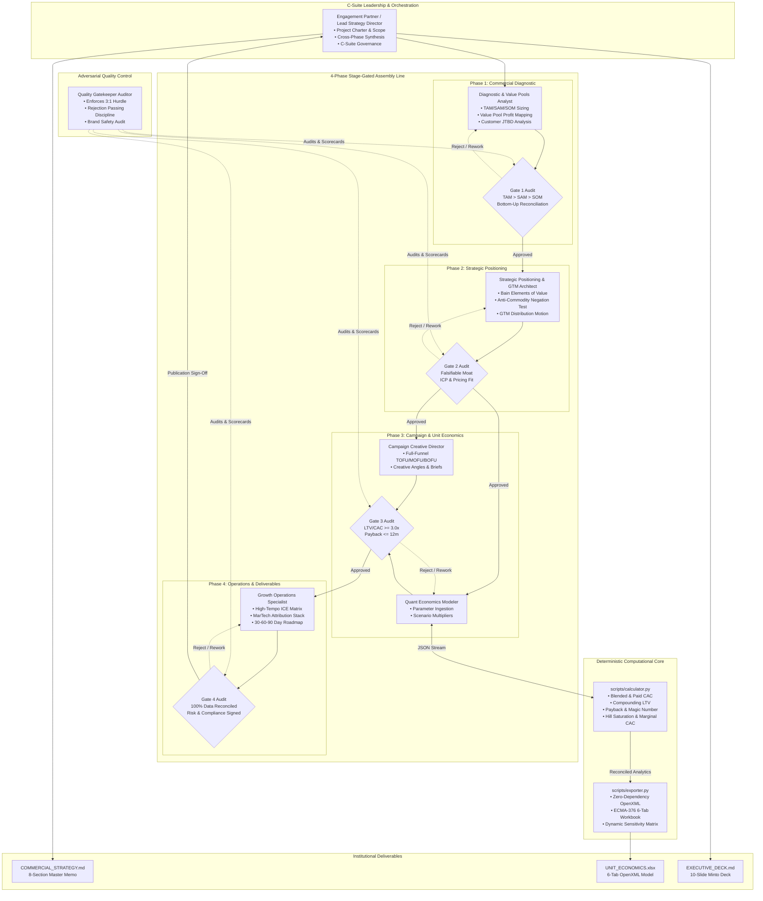
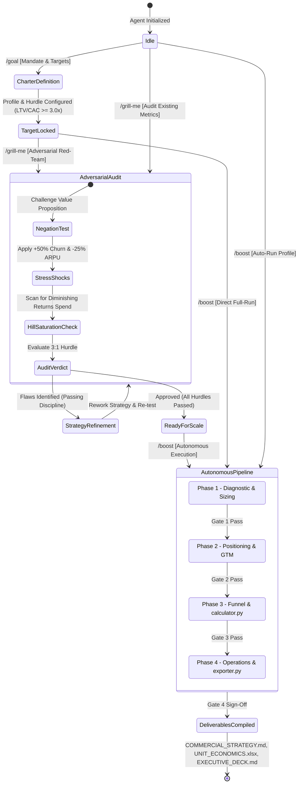

# Institutional Multi-Agent Commercial Strategy Engine
## Technical Architecture & Quantitative Engineering Specification

---

## 1. System Architecture & Multi-Agent Design

The **`marketing-consultant`** skill is engineered as an institutional-grade, multi-agent commercial strategy and quantitative modeling system. It operates on a strict architectural principle: **separation of generative strategic reasoning from deterministic mathematical computation**.



### Core Design Principles:
1. **Decoupled Computation**: Generative agents propose parameters, structure qualitative narratives, and construct hypotheses. All arithmetic, ratios, derivatives, and cohort projections are computed deterministically by `scripts/calculator.py`.
2. **Zero External Dependencies**: Both `calculator.py` and `exporter.py` run on standard Python 3.8+ using only standard library modules (`math`, `json`, `os`, `sys`, `zipfile`, `xml.sax.saxutils`, `argparse`). No third-party packages (`numpy`, `pandas`, `openpyxl`, `xlsxwriter`) are required.
3. **Stage-Gate State Machine**: Execution transitions through 4 discrete phases. Each transition is governed by an adversarial audit scorecard issued by the Quality Gatekeeper.
4. **Data Reconciliation Invariant**: Metrics presented in `COMMERCIAL_STRATEGY.md`, `EXECUTIVE_DECK.md`, and `UNIT_ECONOMICS.xlsx` must match to the exact cent and basis point.

---

### 1.1 Slash Command State Machine (`/goal`, `/grill-me`, `/boost`)

The agent architecture supports three formal state machine triggers that govern the pipeline's execution flow:



#### State Transition Details:

1. **`/goal` (Scope Initialization)**:
   - **Transition**: `IDLE` $\implies$ `CHARTER_LOCKED`.
   - **Context Mutation**: Parses business model archetype (`b2b_saas` vs `b2c_d2c`), ACV/ARPU targets, Gross Margin baseline, and sets the explicit Gate 3 hurdles (e.g. $LTV/CAC \ge 3.0\text{x}$, $\text{Payback} \le 12\text{m}$).
   - **Agent Activation**: Dispatches `Engagement Partner` and `Commercial Diagnostic Analyst` to lock Phase 1-2 charters.

2. **`/grill-me` (Adversarial Interrogation Mode)**:
   - **Transition**: `ANY` $\implies$ `RED_TEAM_INTERROGATION`.
   - **Context Mutation**: Directs the `Quality Gatekeeper` and `Diagnostic Analyst` into an adversarial red-team posture.
   - **Execution Pipeline**:
     - *Anti-Commodity Negation Filter*: Evaluates claims $P$ against $\neg P$; if $\neg P$ is an unviable claim that no competitor would intentionally make, rejects $P$ as non-falsifiable fluff.
     - *Downside Sensitivity Shock*: Injects stress multipliers ($c \times 1.5$, $\text{CAC} \times 2.0$, $\text{Margin} \times 0.8$) into `calculator.py:run_scenarios()` to identify insolvency floors.
     - *Hill Saturation Trap*: Evaluates $\frac{d\text{Output}}{dS}$ across spend tiers; flags channels where $S > S_{50}$ and marginal CAC exceeds target CAC by $>1.5\text{x}$.
     - *Kill Criteria*: Evaluates Gate 3 hurdles. If unit economics fail, halts execution and outputs an adversarial audit report.

3. **`/boost` (Full-Spectrum Autonomous Delivery)**:
   - **Transition**: `ANY` $\implies$ `STAGE_GATED_ASSEMBLY_LINE`.
   - **Execution Pipeline**:
     - Linearly executes Phase 1 (Diagnostic) $\to$ Gate 1 $\to$ Phase 2 (Positioning) $\to$ Gate 2 $\to$ Phase 3 (Funnel & Quantitative Modeling) $\to$ Gate 3 $\to$ Phase 4 (Operations) $\to$ Gate 4.
     - Executes `scripts/calculator.py` on client JSON inputs.
     - Executes `scripts/exporter.py` to compile `UNIT_ECONOMICS.xlsx`.
     - Compiles `COMMERCIAL_STRATEGY.md` and `EXECUTIVE_DECK.md`.
     - Verifies 100% numerical reconciliation before marking the task complete.

---

## 2. Formal Mathematical Derivations & Quantitative Formulations

All calculations in `scripts/calculator.py` are mathematically grounded in microeconomics, actuarial cohort survival analysis, and marketing media mix theory.

### 2.1 Customer Acquisition Cost (CAC)

#### Blended CAC
Measures the fully loaded acquisition cost across all sales and marketing activities:
$$\text{CAC}_{\text{blended}} = \frac{S_{\text{total}}}{N_{\text{total}}}$$
Where:
- $S_{\text{total}}$: Total sales & marketing operational expenditure (paid media, SDR salaries, commissions, tooling, agency fees).
- $N_{\text{total}}$: Total new customers acquired during the measurement period.
- *Boundary Edge Case*: If $N_{\text{total}} \le 0$, $\text{CAC}_{\text{blended}} = 0.0$ (avoids division by zero).

#### Paid CAC
Isolates the direct performance media efficiency:
$$\text{CAC}_{\text{paid}} = \frac{S_{\text{paid}}}{N_{\text{paid}}}$$
Where $S_{\text{paid}}$ is direct advertising spend and $N_{\text{paid}}$ is customers directly attributed to paid channels.

---

### 2.2 Customer Lifetime Value (LTV)

#### Continuous Foundation of Traditional LTV
Let $GP = \text{Monthly ARPU} \times \text{Gross Margin \%}$ denote the monthly gross profit contribution per customer. Under a constant monthly logo churn rate $c \in (0, 1]$, customer survival follows the continuous decay function $S(t) = e^{-ct}$. 
The traditional expected lifetime value is:
$$\text{LTV}_{\text{trad}} = \int_0^\infty GP \cdot e^{-ct} \, dt = GP \left[ -\frac{1}{c} e^{-ct} \right]_0^\infty = \frac{GP}{c} = \frac{\text{Monthly ARPU} \times \text{Gross Margin \%}}{\text{Monthly Logo Churn}}$$

The expected customer relationship lifespan in months is:
$$T_{\text{trad}} = \frac{1}{c}$$

#### Expansion & NRR-Adjusted LTV
In modern subscription models, accounts expand over time through seat expansion, tier upgrades, and feature add-ons at a monthly expansion rate $e \ge 0$. Net churn is defined as:
$$\text{Net Churn} = c - e$$

The mathematical formulation bifurcates into two distinct regimes:

##### Case 1: Net Churn is Positive ($c - e > 0.001$)
When logo churn exceeds account expansion, revenue decays monotonically:
$$\text{LTV}_{\text{exp}} = \frac{GP}{c - e} = \frac{\text{Monthly ARPU} \times \text{Gross Margin \%}}{\text{Monthly Logo Churn} - \text{Monthly Expansion Rate}}$$
$$\text{Lifespan}_{\text{exp}} = \frac{1}{c - e}$$

##### Case 2: Net Churn is Zero or Negative ($e \ge c$)
When expansion equals or exceeds churn, the standard infinite-horizon formula $\frac{GP}{c - e}$ diverges to infinity or becomes negative, which is mathematically invalid for finite business valuation. 

In reality, individual customer logos have an expected finite relationship lifespan governed by logo churn:
$$T = \frac{1}{c}$$
*(or $T = \min(\frac{1}{c}, \text{max\_months\_cap})$ if an explicit cap is configured).*

During this lifespan $T$, customer revenue compounds at the net monthly rate:
$$g = e - c \ge 0$$

In discrete integer-month accounting, the compounding revenue sum is:
$$\text{LTV}_{\text{exp}} = GP \sum_{t=0}^{\lfloor T \rfloor - 1} (1 + g)^t$$

Because the expected logo relationship lifespan $T = \frac{1}{c} \in \mathbb{R}^+$ is generally a continuous real number (e.g. $c = 0.012 \implies T = 83.33\text{ months}$), `scripts/calculator.py` generalizes the finite geometric progression formula continuously:
$$\text{LTV}_{\text{exp}} = GP \times \frac{(1 + g)^T - 1}{g} \quad (\text{for } g > 0)$$
$$\text{LTV}_{\text{exp}} = GP \times T \quad (\text{for } g = 0)$$
This formulation guarantees continuous differentiability without step-function artifacts across fractional churn intervals.

##### Economic Invariant Guarantee:
$$\text{LTV}_{\text{exp}} \ge \text{LTV}_{\text{trad}} \quad \forall e \ge 0$$
Customer expansion can never economically reduce customer lifetime value. `scripts/calculator.py` explicitly enforces:
```python
expansion_ltv = max(traditional_ltv, expansion_ltv)
expansion_lifespan_months = max(traditional_lifespan_months, expansion_lifespan_months)
```

---

### 2.3 Capital Payback Period

Measures the duration in months required for cumulative gross profit from a customer to fully recover the upfront blended CAC:
$$\text{Payback Months} = \frac{\text{CAC}_{\text{blended}}}{GP} = \frac{\text{CAC}_{\text{blended}}}{\text{Monthly ARPU} \times \text{Gross Margin \%}}$$

*Boundary Check*: If $GP \le 0$, the function returns `999.0` (infinite payback).

---

### 2.4 SaaS Growth Magic Number

Measures net new annualized recurring revenue (ARR) generated per dollar invested in sales and marketing in the preceding quarter:
$$\text{Magic Number} = \frac{(\text{Revenue}_Q - \text{Revenue}_{Q-1}) \times 4}{S\&M_{Q-1}} = \frac{\Delta \text{ARR}}{S\&M_{Q-1}}$$

#### Efficiency Benchmark Tiers:
- $\text{Magic Number} \ge 1.0$: Top-decile sales efficiency. Aggressively scale GTM investments.
- $0.75 \le \text{Magic Number} < 1.0$: Healthy commercial efficiency. Continue planned scaling.
- $0.50 \le \text{Magic Number} < 0.75$: Moderate efficiency. Optimize sales cycles and lead qualification before scaling.
- $\text{Magic Number} < 0.50$: Value-destroying GTM engine. Severe pipeline or conversion leakage.

---

### 2.5 Annualized Retention Metrics (NRR & GRR)

Compounding monthly logo churn $c$ and monthly expansion $e$ across 12 discrete billing cycles:

#### Gross Revenue Retention (GRR):
GRR measures the preservation of core recurring revenue, excluding all expansion and upsells (strictly bounded at $\le 100\%$):
$$\text{Annualized GRR} = (1 - c)^{12} \times 100\%$$

#### Net Revenue Retention (NRR):
NRR measures the net revenue trajectory of an existing cohort, fully incorporating expansion, upsells, cross-sells, contractions, and churn:
$$\text{Annualized NRR} = (1 - c + e)^{12} \times 100\%$$

---

### 2.6 Hill Function Diminishing Media Saturation

Advertising response curves exhibit S-shaped diminishing returns. At low spend, response is slow; at moderate spend, response accelerates; at high spend, the target audience saturates.

The deterministic engine models channel response using the classical **Hill Function**:
$$\text{Output}(S) = K \times \frac{S^n}{S_{50}^n + S^n}$$
Where:
- $S$: Channel media spend (\$)
- $K$: Maximum achievable output ceiling (e.g., maximum possible leads or acquisitions)
- $S_{50}$: Half-saturation spend level (the spend at which $\text{Output}(S_{50}) = 0.5 \times K$)
- $n$: Shape parameter controlling curve steepness ($n > 1$ creates an S-curve; $n = 1$ creates a hyperbolic Michaelis-Menten curve)

#### Analytical Derivative (Marginal Response):
To compute the exact efficiency of the next marginal dollar, we take the first derivative with respect to spend $S$:
$$\frac{d\text{Output}}{dS} = K \cdot \frac{d}{dS} \left( \frac{S^n}{S_{50}^n + S^n} \right)$$
Applying the quotient rule:
$$\frac{d\text{Output}}{dS} = K \times \frac{(S_{50}^n + S^n)(n S^{n-1}) - (S^n)(n S^{n-1})}{(S_{50}^n + S^n)^2} = \frac{K \cdot n \cdot S^{n-1} \cdot S_{50}^n}{(S_{50}^n + S^n)^2}$$

#### Marginal Metrics:
$$\text{Marginal CAC} = \frac{1}{d\text{Output}/dS}$$
$$\text{Average CPA} = \frac{S}{\text{Output}(S)}$$

---

### 2.7 24-Month Cohort Trajectory & Empirical Continuity

When evaluating customer cohorts over 24 months, clients often possess empirical retention data for the first several months (e.g., months 0 through 12), while subsequent months (13 through 24) must be projected.

If an empirical curve $C = [r_0, r_1, \dots, r_k]$ is provided:
- For month $m \le k$: $\text{Retention}(m) = r_m$.
- For month $m > k$: To prevent unnatural discontinuous upward jumps at month $k+1$, decay continues smoothly from the last observed empirical retention point $r_k$:
$$\text{Retention}(m) = r_k \times (1 - c)^{m - k}$$

Cumulative Gross Profit per initially acquired customer at month $m$:
$$\text{CumGP}(m) = \sum_{t=0}^m \frac{\text{Active Customers}(t) \times \text{ARPU}(t) \times \text{Gross Margin}}{N_0}$$
Where $\text{ARPU}(t) = \text{ARPU}_0 \times (1 + e)^t$.

The cash breakeven month is formally identified when:
$$\text{CumGP}(m^*) \ge \text{CAC}_{\text{blended}}$$

---

## 3. Core Engine Architecture (`scripts/calculator.py`)

### Module Breakdown & API Signatures

```python
def calculate_cac(sm_spend: float, new_customers: int, paid_spend: float = None, paid_customers: int = None) -> dict
```
- **Description**: Computes Blended CAC and Paid CAC.
- **Returns**: Dictionary with `blended_cac`, `paid_cac`, `sm_spend`, `new_customers`.

```python
def calculate_ltv(arpu_monthly: float, gross_margin_pct: float, monthly_churn: float, monthly_expansion: float = 0.0, max_months_cap: float = None) -> dict
```
- **Description**: Computes Traditional LTV, Expansion LTV, and customer lifespans.
- **Returns**: Dictionary containing all intermediate and final LTV metrics.

```python
def calculate_payback_months(cac: float, arpu_monthly: float, gross_margin_pct: float) -> float
```
- **Description**: Computes exact months to breakeven on acquisition spend.

```python
def calculate_magic_number(prior_q_revenue: float, current_q_revenue: float, prior_q_sm_spend: float) -> float
```
- **Description**: Computes annualized Net New ARR per dollar of prior-quarter S&M.

```python
def calculate_retention_metrics(monthly_logo_churn: float, monthly_expansion: float = 0.0) -> dict
```
- **Description**: Computes Annualized Logo Churn, Annualized GRR, and Annualized NRR.

```python
def calculate_hill_saturation(spend: float, max_output: float, half_sat_spend: float, shape_n: float) -> dict
```
- **Description**: Computes Hill response, saturation percentage, marginal response derivative, and marginal CAC.

```python
def simulate_cohort_trajectory(initial_cohort_size: int, arpu_monthly: float, gross_margin_pct: float, monthly_churn: float, monthly_expansion: float = 0.0, custom_curve: list = None, horizon_months: int = 24, blended_cac: float = 0.0) -> dict
```
- **Description**: Models 24-month cohort decay, cumulative gross profit, and breakeven month.

```python
def run_scenarios(base_inputs: dict) -> dict
```
- **Description**: Evaluates Base, Bull, and Bear scenarios applying multipliers to ARPU, Churn, CAC, and Conversions.

```python
def evaluate_gate_hurdles(ltv_cac_ratio: float, payback_months: float, magic_number: float = None, business_model: str = "b2b_saas") -> dict
```
- **Description**: Evaluates metrics against institutional thresholds and issues Gate 3 Scorecard and Overall Verdict.

```python
def analyze_model(data: dict) -> dict
```
- **Description**: Master orchestration entry point executing the end-to-end quantitative analysis.

---

### Command-Line Interface (CLI)
```bash
# Execute analysis against a client input JSON
python3 /Users/tonkla/.gemini/config/skills/marketing-consultant/scripts/calculator.py \
  --input /path/to/inputs.json \
  --profile b2b_saas \
  --output /path/to/results.json \
  --print-summary

# Run the 11-assertion internal test suite
python3 /Users/tonkla/.gemini/config/skills/marketing-consultant/scripts/calculator.py --test
```

---

## 4. Zero-Dependency OpenXML Spreadsheet Engine (`scripts/exporter.py`)

### Architecture & Motivation
Commercial spreadsheets must be clean, correctly formatted, and easily readable by corporate executives. External packages like `openpyxl` or `xlsxwriter` are heavy, fail in restricted or air-gapped environments, and require external pip installations.

`scripts/exporter.py` implements a zero-dependency OpenXML compiler that constructs ECMA-376 compliant `.xlsx` files using Python's standard `zipfile` and `xml.sax.saxutils`.

### Physical ZIP File Structure
An `.xlsx` file is an OPC (Open Packaging Convention) ZIP container structured as follows:

```text
UNIT_ECONOMICS.xlsx (ZIP Container)
├── [Content_Types].xml               # MIME types for XML parts
├── _rels/
│   └── .rels                         # Package relationship to workbook
└── xl/
    ├── workbook.xml                  # Sheet definitions and IDs
    ├── styles.xml                    # Fonts, fills, borders, number formats (numFmts)
    ├── _rels/
    │   └── workbook.xml.rels         # Sheet and style relationships
    └── worksheets/
        ├── sheet1.xml                # Executive Dashboard
        ├── sheet2.xml                # CAC & Payback Trajectory
        ├── sheet3.xml                # Cohort Retention & Churn Decay
        ├── sheet4.xml                # Media Budget & Saturation Curves
        ├── sheet5.xml                # 3-Scenario Sensitivity Analysis
        └── sheet6.xml                # ICE Growth Matrix
```

### Number Formatting & Styling Specifications (`xl/styles.xml`)
Standard ECMA-376 `numFmts` are explicitly mapped to avoid Excel localization errors:
- **`numFmtId="164"`**: `"$#,##0.00"` (Currency with cents)
- **`numFmtId="165"`**: `"$#,##0"` (Integer currency)
- **`numFmtId="166"`**: `"0.0%"` (Single-decimal percentage)
- **`numFmtId="167"`**: `"0.00%"` (Two-decimal percentage)
- **`numFmtId="168"`**: `"0.0\"x\""` (Multiple/ratio formatting)

#### Corporate Color Palette:
- **Navy Primary (`#1F4E79`)**: Table headers and major section titles with bold white text (`#FFFFFF`).
- **Soft Blue Accent (`#D9E1F2`)**: Key KPI metrics and emphasized ratios.
- **Pass Green (`#E2EFDA`)**: Dark green text (`#375623`) for `PASS` and `APPROVED` statuses.
- **Warning Yellow (`#FFF2CC`)**: Dark gold text (`#7F6000`) for `CONDITIONAL` statuses.
- **Alert Red (`#FCE4D6`)**: Crimson text (`#C00000`) for `FAIL`, `REJECTED`, and deficit positions.

### Numeric Value Tagging: `<c r="A1" s="..."><v>...</v></c>`
Unlike rudimentary tools that store all values as strings (`t="inlineStr"`), `exporter.py` checks for numeric data (`num_val` or raw numbers) and outputs native `<v>` value nodes. This preserves native Excel sorting, conditional formatting, and formula references for client analysts.

### Dynamic 2D Sensitivity Grid Construction
In Tab 5 (Scenario Sensitivity), the engine dynamically centers the sensitivity matrix around the client's actual baseline ARPU and churn rate:
```python
test_arpus = [round(base_arpu * m, 2 if base_arpu < 100 else 0) for m in [0.6, 0.8, 1.0, 1.2, 1.5]]
test_churns = [round(base_churn * m, 4) for m in [0.5, 0.75, 1.0, 1.5, 2.0]]
```
This guarantees that a B2C client with a \$20 ARPU receives a grid scaled from \$12 to \$30, rather than a broken matrix hardcoded for an enterprise B2B \$1,500 ARPU.

---

## 5. Quality Gatekeeper Audit Logic & Rule Engine

The Quality Gatekeeper enforces four sequential audit gates. Each gate evaluates formal quantitative assertions:

```text
┌────────────────────────────────────────────────────────────────────────────────────────┐
│                          STAGE-GATE AUDIT SPECIFICATIONS                               │
├────────┬─────────────────────────┬─────────────────────────────────────────────────────┤
│ Gate 1 │ Diagnostic Audit        │ • TAM > SAM > SOM                                   │
│        │                         │ • Bottom-Up check: |SOM - (N x ACV)| / SOM < 0.20   │
│        │                         │ • JTBD: >= 3 functional, >= 2 emotional/social jobs │
├────────┼─────────────────────────┼─────────────────────────────────────────────────────┤
│ Gate 2 │ Positioning Audit       │ • Negation Test: non-falsifiable claims rejected    │
│        │                         │ • Bain Elements: 3-5 top-decile elements selected   │
│        │                         │ • GTM Motion: economic alignment (SLG vs PLG)       │
├────────┼─────────────────────────┼─────────────────────────────────────────────────────┤
│ Gate 3 │ Unit Economics Hurdle   │ • LTV/CAC >= 3.0x (PASS), 1.5-3.0x (COND), <1.5x(FAIL│
│        │                         │ • Payback <= 12m B2B / <= 6m B2C (PASS)             │
│        │                         │ • Magic Number >= 0.75 (PASS if B2B)                │
├────────┼─────────────────────────┼─────────────────────────────────────────────────────┤
│ Gate 4 │ Final Deliverables      │ • 100% data reconciliation across memo, deck, xlsx  │
│        │                         │ • Valid OpenXML ECMA-376 structure (zero corruption)│
│        │                         │ • Minto Pyramid action titles on all 10 slides      │
└────────┴─────────────────────────┴─────────────────────────────────────────────────────┘
```

---

## 6. Verification, Test Suites & Edge-Case Resilience

The skill includes comprehensive automated self-tests built directly into `calculator.py` and `exporter.py`.

### 1. Quantitative Calculator Test Suite (13 Assertions)
Run via: `python3 scripts/calculator.py --test`
1. **Test 1: CAC Calculation**: Validates blended CAC and paid CAC under known spend and acquisition volumes.
2. **Test 2: LTV and Payback**: Tests baseline ARPU (\$2,000), gross margin (80%), and churn (2%), verifying expected gross profit (\$1,600), traditional LTV (\$80,000), lifespan (50m), and payback (5.0m).
3. **Test 3: Expansion Compounding**: Tests negative net churn ($c = 0.01, e = 0.02$). Verifies that expansion LTV strictly exceeds traditional LTV (\$160,000) and lifespan expands.
4. **Test 4: SaaS Magic Number**: Tests quarter-over-quarter ARR growth against prior S&M spend.
5. **Test 5: Hill Saturation Boundary**: Verifies that at spend $S = S_{50}$, the calculated output is exactly 50% of maximum output $K$.
6. **Test 6: Gate Hurdle Evaluations**: Tests boundary thresholds for `APPROVED` vs `REJECTED` verdicts.
7. **Test 7: B2B SaaS Integration**: Validates end-to-end model execution on `NexusFlow AI` baseline.
8. **Test 8: B2C D2C Integration**: Validates end-to-end model execution on `Verve Longevity` baseline.
9. **Test 9: Cohort Retention Monotonic Continuity**: Regression test ensuring that when custom empirical retention curves end, projected retention never experiences an upward discontinuity.
10. **Test 10: Direct CAC Fallback**: Validates fallback when clients provide a direct `blended_cac` field without separate S&M expenditure.
11. **Test 11: Hill High-Spend Sensitivity**: Verifies that extreme saturation spend levels ($S \gg S_{50}$) compute valid asymptotic marginal CAC without zero-division or overflow errors.
12. **Test 12: Sub-linear Hill Shape ($n < 1.0$) & Boundary Safety**: Verifies that sub-linear curvature ($n = 0.75$) computes positive response and valid marginal CAC across spend tiers, while non-positive shape parameters ($n \le 0$) safely return zero response and None marginal CAC.
13. **Test 13: Percentage Input Auto-Normalization**: Asserts that users providing whole-number percentage inputs (e.g. `gross_margin_pct=80.0`, `monthly_churn=2.0`, `monthly_expansion=1.5`) calculate mathematically identical results to decimal fraction inputs (`0.80`, `0.02`, `0.015`).

### 2. OpenXML Exporter Test Suite
Run via: `python3 scripts/exporter.py --test`
1. **ZIP Container Integrity**: Verifies presence of `[Content_Types].xml`, `_rels/.rels`, `xl/workbook.xml`, and `xl/styles.xml`.
2. **ECMA-376 Number Format Validation**: Verifies `numFmtId="164"` through `168` in `styles.xml`.
3. **XML Syntax Parsing (`xml.etree.ElementTree`)**: Parses all 6 generated worksheet XML strings to ensure zero malformed tags or entities.
4. **Native Value Node Verification**: Asserts `<v>` numeric nodes exist in `sheet1.xml`.
5. **Dynamic Sensitivity Grid Test**: Verifies that B2C models generate scaled ARPU headers (e.g., `"$20.40 ARPU"`) and do not contain hardcoded B2B figures.

---

## 7. JSON Schema Specifications

### 7.1 Input Schema (`templates/sample_inputs.json`)

```json
{
  "$schema": "http://json-schema.org/draft-07/schema#",
  "title": "CommercialStrategyInputs",
  "type": "object",
  "required": ["company_name", "business_model", "unit_economics"],
  "properties": {
    "company_name": { "type": "string" },
    "industry": { "type": "string" },
    "business_model": { "type": "string", "enum": ["b2b_saas", "b2c_d2c", "marketplace", "hybrid"] },
    "currency": { "type": "string", "default": "USD" },
    "market_sizing": {
      "type": "object",
      "properties": {
        "tam": { "type": "number" },
        "sam": { "type": "number" },
        "som": { "type": "number" },
        "tam_description": { "type": "string" },
        "sam_description": { "type": "string" },
        "som_description": { "type": "string" }
      }
    },
    "unit_economics": {
      "type": "object",
      "required": ["arpu_monthly", "gross_margin_pct", "monthly_logo_churn"],
      "properties": {
        "arpu_monthly": { "type": "number" },
        "acv_annual": { "type": "number" },
        "gross_margin_pct": { "type": "number", "minimum": 0, "maximum": 1 },
        "monthly_logo_churn": { "type": "number", "minimum": 0, "maximum": 1 },
        "monthly_expansion_rate": { "type": "number", "default": 0.0 },
        "sales_and_marketing_monthly": { "type": "number" },
        "paid_ad_spend_monthly": { "type": "number" },
        "new_customers_monthly": { "type": "integer" },
        "paid_customers_monthly": { "type": "integer" },
        "organic_customers_monthly": { "type": "integer" },
        "sales_cycle_days": { "type": "integer" },
        "prior_quarter_sm_spend": { "type": "number" },
        "prior_quarter_revenue": { "type": "number" },
        "current_quarter_revenue": { "type": "number" }
      }
    },
    "channels": {
      "type": "array",
      "items": {
        "type": "object",
        "required": ["name", "current_spend", "max_output", "half_sat_spend", "shape_n"],
        "properties": {
          "name": { "type": "string" },
          "current_spend": { "type": "number" },
          "max_output": { "type": "number" },
          "half_sat_spend": { "type": "number" },
          "shape_n": { "type": "number" },
          "output_unit": { "type": "string" }
        }
      }
    },
    "cohort_retention_curve": {
      "type": "array",
      "items": { "type": "number", "minimum": 0, "maximum": 1 }
    },
    "ice_experiments": {
      "type": "array",
      "items": {
        "type": "object",
        "required": ["id", "stage", "name", "hypothesis", "impact", "confidence", "ease"],
        "properties": {
          "id": { "type": "string" },
          "stage": { "type": "string", "enum": ["TOFU", "MOFU", "BOFU", "RETENTION"] },
          "name": { "type": "string" },
          "hypothesis": { "type": "string" },
          "metric": { "type": "string" },
          "impact": { "type": "integer", "minimum": 1, "maximum": 10 },
          "confidence": { "type": "integer", "minimum": 1, "maximum": 10 },
          "ease": { "type": "integer", "minimum": 1, "maximum": 10 },
          "owner": { "type": "string" },
          "status": { "type": "string" }
        }
      }
    }
  }
}
```

---

## 8. Developer Integration & Extension Guide

### Embedding in Automated CI/CD Pipelines
To run the deterministic marketing analytics engine within automated reporting jobs or continuous deployment pipelines:

```bash
#!/usr/bin/env bash
set -euo pipefail

INPUT_FILE="client_data.json"
OUTPUT_JSON="calculated_results.json"
OUTPUT_XLSX="UNIT_ECONOMICS.xlsx"

# 1. Run Quantitative Engine
python3 scripts/calculator.py \
  --input "${INPUT_FILE}" \
  --profile "b2b_saas" \
  --output "${OUTPUT_JSON}" \
  --print-summary

# 2. Compile Institutional Spreadsheet
python3 scripts/exporter.py \
  --input "${OUTPUT_JSON}" \
  --output "${OUTPUT_XLSX}"

echo "Commercial consulting pipeline completed successfully."
```

### Adding New Business Models
To extend the engine to support new business models (e.g., Usage-Based API pricing, Two-Sided Marketplaces):
1. In `scripts/calculator.py`, update `evaluate_gate_hurdles()` with industry-specific payback thresholds:
   ```python
   elif business_model == "usage_api":
       max_payback = 9.0
       cond_payback = 14.0
   ```
2. In `scripts/exporter.py`, adjust `generate_workbook_content()` to customize KPI labels and cohort initial sizing.
3. In `templates/sample_inputs.json`, add representative benchmark profiles under a new top-level key.

---

*Authored by the Google Antigravity Commercial Strategy & Marketing Consulting Practice.*
